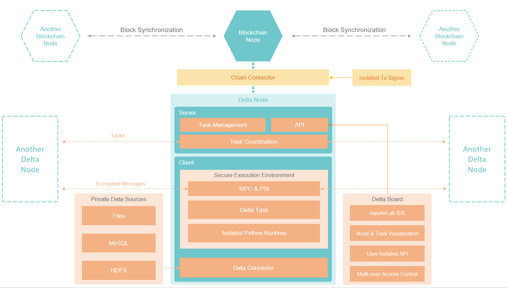

# Delta隐私计算网络结构

## 系统参与者

系统参与者可以按照角色分为三类：数据所有者、数据使用者、网络搭建者：

**数据持有者**

数据持有者持有原始数据，不希望原始数据被泄露出去。在数据不出门的前提下，接收其他参与者的计算任务，在本地完成计算并将计算结果发送回去。在Delta框架中，数据持有者在本地搭建Delta节点接入隐私计算网络，并将Delta节点接入本地的原始数据源。Delta节点从网络中接收计算任务，在本地的数据集上执行计算过程，得到计算结果，并将加密后的计算结果发送回隐私计算网络。

**数据需求方**

数据需求方不持有数据，但是有一些计算需求，需要在其他多个数据持有者的数据集上执行一些计算任务（分为统计计算和机器学习模型训练两类），获取计算结果，并需要确保计算结果的正确性。在Delta框架中，数据需求方使用Delta提供的Python框架编写计算任务（Delta Task），通过Delta Node提供的API将Task发送到隐私计算网络中完成计算，获取计算结果。

数据需求方可自行搭建Delta Node，接入隐私计算网络，并通过自己的Delta Node提交计算任务。也可以在获得授权后，使用其他数据持有者提供的Delta Node来提交计算任务。

**网络搭建者**

网络搭建者需要联合一个特定行业的多家数据持有者一起，搭建一个隐私计算网络，将多家的数据源联合起来提供给特定的数据需求方使用。由于数据持有者可能不具备搭建Delta Node的技术能力，一般由网络搭建者负责帮数据持有者完成Delta Node搭建和配置、原始数据源的接入工作，并负责Delta Node的日常运维工作。

在特定场景下，一个系统参与者可以同时具备多个角色。比如在联合医疗隐私计算场景中，一家医院既是数据持有者，将医院内部的数据接入隐私计算网络，同时又是数据需求方，医院内部需要使用全网的数据进行计算，将计算结果用于本院的系统优化或者科研。

## 隐私计算网络结构

Delta隐私计算网络由Delta Node节点和区块链节点共同组成。每一家加入网络的数据持有者，都需要启动一个区块链节点以及一个Delta Node节点。

隐私计算网络首先由区块链节点完成P2P组网，Delta Node连接到区块链节点，在区块链上注册身份，获取待执行的计算任务，并上报计算过程和计算结果数据。Delta Node之间也会形成一个网络，用于计算任务的内容下发、结果上报，以及安全多方计算、PSI等隐私计算技术涉及到的多方秘密共享。

Delta网络中的区块链节点可以使用Delta提供的Delta Chain搭建，也可以使用任意其他的区块链系统，比如Ethereum，只要在区块链上部署了对应版本的Delta智能合约，并将Delta Node接入即可。Delta提供了Solidity语言的智能合约，可直接部署在以太坊上。为了方便多种区块链系统的切换，以及安全的管理区块链账号涉及到的密钥，Delta抽象出了Chain Connector组件，用于管理Delta Node和区块链节点之间的连接。在Chain Connector中可以方便的切换不同的区块链系统，Chain Connector也支持配置一个额外的离线签名机用于密钥托管，实现密钥的离线保存和使用。

Delta Node是整个隐私计算网络的核心，负责计算任务的整个生命周期的管理，包括任务注册、多节点间任务协调、任务本地执行、结果上报、结果聚合等整个任务执行流程，在整个生命周期中保证本地数据的隐私安全，同时对外提供API，供IDE或者其他系统接入。

为了方便数据需求方本地开发调试，Delta提供了Delta Board实现对Delta Node的可视化管理。Delta Board中嵌入了JupyterLab，可以直接进行Delta Task的开发和可视化调试的工作。

