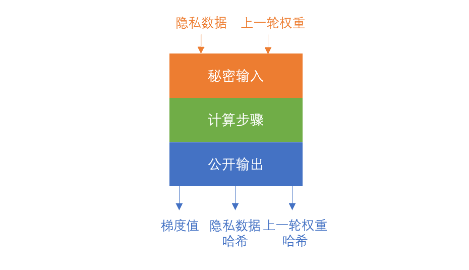

# 系统架构说明

## 系统参与者

系统参与者可以按照角色分为三类：数据持有者、数据需求方、网络搭建者：

**数据持有者**

数据持有者持有原始数据，不希望原始数据被泄露出去。在数据不出门的前提下，接收其他参与者的计算任务，在本地完成计算并将计算结果发送回去。在Delta框架中，数据持有者在本地搭建Delta节点接入隐私计算网络，并将Delta节点接入本地的原始数据源。Delta节点从网络中接收计算任务，在本地的数据集上执行计算过程，得到计算结果，并将加密后的计算结果发送回隐私计算网络。

**数据需求方**

数据需求方不持有数据，但是有一些计算需求，需要在其他多个数据持有者的数据集上执行一些计算任务（分为统计计算和机器学习模型训练两类），获取计算结果，并需要确保计算结果的正确性。在Delta框架中，数据需求方使用Delta提供的Python框架编写计算任务（Delta Task），通过Delta Node提供的API将Task发送到隐私计算网络中完成计算，获取计算结果。

数据需求方可自行搭建Delta Node，接入隐私计算网络，并通过自己的Delta Node提交计算任务。也可以在获得授权后，使用其他数据持有者提供的Delta Node来提交计算任务。

**网络搭建者**

网络搭建者需要联合一个特定行业的多家数据持有者一起，搭建一个隐私计算网络，将多家的数据源联合起来提供给数据需求方使用。由于数据持有者可能不具备搭建Delta Node的技术能力，一般由网络搭建者负责帮数据持有者完成Delta Node搭建和配置、原始数据源的接入工作，并负责Delta Node的日常运维工作。

在特定场景下，一个系统参与者可以同时具备多个角色。比如在联合医疗隐私计算场景中，一家医院既是数据持有者，将医院内部的数据接入隐私计算网络，同时又是数据需求方，医院内部需要使用全网的数据进行计算，将计算结果用于本院的系统优化或者科研。

## 网络结构

Delta隐私计算网络是一个点对点的对等网络。多家数据持有者各自搭建节点，连接自家的数据。多个节点连接起来形成网络结构。在这个网络中每个节点都是完全一样的（对等的），具备完全相同的功能，也具有完全相同的权限。每个节点都可以自由的加入网络，也可以随时退出网络，而不会影响整个网络的功能。

网络中的每个节点，又由两部分组成：区块链节点和Delta Node计算节点。每一家加入网络的数据持有者，都需要启动一个区块链节点以及一个Delta Node节点。区块链节点和Delta Node节点之间通过Chain Connector进行连接。

隐私计算网络首先由区块链节点完成P2P组网。Delta Node通过Chain Connector抽象层连接到区块链节点，在区块链上注册身份，获取待执行的计算任务，并上报计算过程和计算结果数据。Delta Node之间也会形成一个网络，用于计算任务的内容下发、结果上报，以及安全多方计算、PSI等隐私计算技术涉及到的多方秘密共享。

Deltaboard用于对于Delta Node的可视化管理，同时嵌入JupyterLab做为IDE，实现在线的任务编写和调试。Deltaboard提供多用户管理的功能，支持多人同时使用同一个Delta Node。

## Delta区块链

区块链的核心功能是确保多方对于同一套规则的强制执行。区块链一般用于构建非中心化系统，使得整个系统在没有中心控制方的情况下能够正常稳定运转。在隐私计算网络的场景中，各个数据持有者之间关系对等，也很难将整个系统的控制权交由一个单一的控制方，但是整个系统需要一套统一的规则来分发任务、执行任务、并且上报结果，因此非常适合使用区块链来构建一个非中心化网络。任何数据持有者都可以自由地选择何时加入、退出网络，而不会影响整个网络的正常运转。只要有计算需求，并且有数据持有者愿意提供数据，网络就可以正常运转。

在非中心化系统的设计中有两个核心的问题要解决，一个是激励的问题，一个是防作弊的问题。

激励的问题是说，系统的正常运转依赖于有足够的数据持有者加入网络做节点，提供数据和算力。如果没有足够的收益，数据持有者是不愿意加入网络的。在隐私计算网络中，数据提供者的收益理论上应该来自于数据需求方的付费。数据需求方付费购买数据使用权，换回计算结果，而数据提供者提供数据和算力，获得收益。系统可以在付费中扣除部分手续费，用于激励早期用户参与。这就构成了一个基础的激励模型。而区块链的作用，就是可以保证这个激励模型在没有中心化控制方的情况下正常稳定的执行。

有了激励，就有了作弊的问题。对于数据提供方来说，通过提供数据和算力可以获得收益，那么数据提供方就有伪造数据和算力，来获取额外收益的动机。因此，如何通过机制设计，在进行了一次计算任务后，可以识别出数据提供方提供了真实数据，并且完成了真实的计算，就成了一个难题。如果识别过程有漏洞，会导致计算结果不可信，以至于数据需求方不再使用本系统。

在目前的Delta框架中，我们假设激励的问题已经由网络搭建者通过外部手段解决。在框架中暂时不包括激励机制的设计和运行，而是专注于隐私计算本身的功能和性能，以更好的满足用户需求。对于数据以及计算过程的可信性保障的问题，则通过零知识证明来解决。详细说明请参考系统详细设计中的对应文档。

Delta中区块链的作用可以分为三个：

**点对点网络构建：**通过区块链来构建基础的隐私计算网络，实现网络节点发现、节点数字身份注册等功能。

**计算任务发布和计算任务协调：**通过智能合约保证网络中关于计算任务的发布、运行、上报的规则能够被统一执行。

**数据和计算的可信性保障：**日常更新数据的链上零知识存证，以及计算任务执行过程的零知识证明上链和校验。

Delta网络中的区块链节点可以使用Delta提供的[Delta Chain](https://github.com/delta-mpc/delta-chain)搭建，也可以使用任意其他的区块链系统，比如Ethereum，只要在区块链上部署了其对应的[Delta智能合约](https://github.com/delta-mpc/delta-contracts)，并将Delta Node接入即可。Delta对于区块链系统唯一一个较高要求是，假如需要使用到数据和计算的可信性保障，则区块链系统需要支持zk-SNARKs底层需要的密码学操作EC Pairing。

Delta也提供了Solidity语言的[智能合约](https://github.com/delta-mpc/delta-contracts)，可直接部署在以太坊上。为了方便多种区块链系统的切换，以及安全的管理区块链账号涉及到的密钥，Delta抽象出了[Chain Connector](https://github.com/delta-mpc/delta-node-chain-connector)组件，用于管理Delta Node和区块链节点之间的连接。在Chain Connector中可以方便的切换不同的区块链系统，Chain Connector也支持配置一个额外的离线签名机用于密钥托管，实现密钥的离线保存和使用。

## 无区块链网络

使用区块链系统进行任务协调会导致任务执行速度大大降低，在一些科研使用、测试使用，或者是对于计算结果的可信性要求不那么高的场景中，我们可以移除区块链系统，将Chain Connector设置为Coordinator模式，在此模式下的Chain Connector无需区块链，可以做为网络中心节点，连接多个Delta Node直接完成组网和计算任务协调的功能。

## Delta Node

[Delta Node](https://github.com/delta-mpc/delta-node)是整个隐私计算网络的核心，负责计算任务的整个生命周期的管理，包括任务注册、多节点间任务协调、任务本地执行、结果上报、结果聚合等整个任务执行流程，在整个生命周期中保证本地数据的隐私安全，同时对外提供API，供IDE或者其他系统接入。

Delta Node的数据连接层连接到数据持有者的本地数据，可通过不同的适配器连接多种数据格式，比如文件、MySQL关系型数据库以及HDFS大数据存储等。Delta Node提供API供外部调用，完成任务注册、任务状态查询、计算结果下载等任务相关的功能，以及任务列表查询、节点状态查询、节点配置等节点管理的功能。

Delta Node的核心是完成Delta Task的注册、全网分发和计算，按照功能可以分为Server和Client两部分。Server端是任务的发起方，数据需求方编写的[Delta Task](https://github.com/delta-mpc/delta-task)通过Delta Node的Server端API提交到系统中，由Server端注册到区块链上开始执行，执行过程中其他节点的Client端会从Server端获取Delta Task代码，并上报本节点的计算结果片段，由Server端进行最终的聚合，得到计算结果。在需要多轮计算的任务中，Server端会多次在链上发起计算请求，并综合多轮的计算得到最终结果。出于安全和隐私的考虑，最终计算结果仅有发起任务的Server端可以获取到，不会在链上公开。

Client端是计算任务的实际执行环境。Client端监测链上的任务，获取到任务后，从发起方Delta Node的Server端获取执行代码（Delta Task），在本地的安全执行环境中通过Data Connector获取数据并执行计算。在需要MPC（安全多方计算）时，Client端会和其他Delta Node节点的Client端进行通信并进行一些加密数据的交换（此交换不会泄露原始数据）。在横向联邦计算的场景中，计算结果会经过安全聚合加密，只有在任务发起的Server端拿到全部的加密结果片段后，进行累加，才能得到最终的平均数据，单个Client端的计算结果，不会有任何形式的暴露。

Data Connector负责连接Delta Node和数据提供方的隐私数据。包含一个对数据进行标准化描述的协议，Delta Task中可以直接使用协议SDK来引用数据。Data Connector支持连接多个不同的数据源，包括文件、关系型数据库、HDFS等，并支持对数据源的数据进行自动校验和清洗。Delta Node接收到计算任务后，判断自身的数据是否满足计算条件并上报给任务发起方，任务发起方根据各个节点的数据持有情况来决定采用哪种隐私计算策略。

Delta Node的安全执行环境是保证原始数据不对外泄露的核心。对于数据安全的保障分为如下几个方面：

首先当然是隐私计算的算法保证，通过MPC、横向和纵向联邦学习以及差分隐私，保证原始数据不对外泄露，以及单个节点的统计数据也不会对外泄露。Delta Task的计算结果，只能拿到多个节点综合起来的统计数据，无法获取单个节点的统计数据。

然后是对于Delta Task代码的安全性检查，包括静态代码扫描以及动态影响范围检查两种方式，防止Delta Task中嵌入除了数据计算以外的恶意代码，造成数据泄露。比如在Delta Task的数据预处理阶段，拿到原始数据后，直接调用http库上传原始数据到目标服务器。

最后是对于Python执行环境的安全隔离，包括运行环境隔离和网络环境隔离等。防止Delta Task利用运行环境中的工具和漏洞渗透进数据所有者的机器，进一步获取并上传原始数据。

## Delta Task

Delta隐私计算框架的设计思想是对隐私计算进行封装隔离，降低开发者搭建隐私计算网络的学习成本。让开发者在不需要了解任何隐私计算原理的前提下，完成搭建网络并编写、执行隐私计算任务。

隐私计算任务是Delta框架的核心功能，[Delta Task](https://github.com/delta-mpc/delta-task)就是对隐私计算任务的封装。从Delta Task的开发者角度，开发者在开发Delta Task时，无需了解隐私计算，只需按照自己以前的方法，在Delta Task框架下编写计算逻辑即可。

Delta Task使用Python语言编写，开发者需要先引入Delta Task框架，实例化一个Delta Task，并在Delta Task中完成数据预处理、训练模型的定义，然后将Delta Task发送到Delta Node进行执行。

Delta Node接收到Task后，在全网完成任务的分发，并根据任务定义，以及其他节点上报的数据情况，决定隐私计算的类型，将任务分类为横向联邦学习、纵向联邦学习和联邦统计中的一种，按照对应的隐私计算算法完成任务拆分、多节点协调和计算结果汇总，最终完成计算并得到计算结果。

为了方便开发者的开发调试工作，Delta Task框架中集成了Delta Node的API，可以直接调用Delta Node注册Delta Task，开始计算过程，并可以实时从Log中看到Task在Delta Node上的执行状况。通过这样的设计，只要开发者本地有Python运行环境，Delta Task就可以从本地开发环境中直接启动，而无需先进入另一个"任务上传"的界面上传代码。开发者只需要在Delta Task框架初始化时指定Delta Node的地址即可。

由于进行全网计算的任务耗时一般较长，而开发者在真正进行大规模数据计算之前往往有一个小规模数据的调试过程，以确认代码正确。Delta Task框架这样的设计，可以让我们很方便的实现一个本地调试专用的Delta Node，在本地放置小的数据集，让Delta Task连接这个本地Delta Node，在本地数据上快速测试代码逻辑的正确性，无需网络通信。本地调试专用的Delta Node已包含在Delta Task框架中，开发者可以直接使用。

## Deltaboard

为了方便数据需求方本地开发调试，Delta提供了[Deltaboard](https://github.com/delta-mpc/deltaboard)实现对Delta Node的可视化管理。Deltaboard中嵌入了[JupyterLab](https://jupyter.org)，可以直接进行Delta Task的开发和可视化调试的工作。

除了JupyterLab以外，Deltaboard支持账号和权限配置，可多人同时提交计算任务，并查看各自的任务执行状态。Deltaboard中支持对于Delta Node的配置，可查看Delta Node的节点状态以及任务执行情况。

加入了Deltaboard后，同一个Delta Node可供多人使用，每个开发者在Deltaboard中都可以获得一个独立的API地址，可以在自己的Delta Task中通过这个API地址调用Delta Node。并且在Deltaboard的账号中查看自己的任务执行状态。

Delta官网上提供的在线演示版本，就是直接搭建了一个Deltaboard的服务，详情请阅读对应章节的内容。

