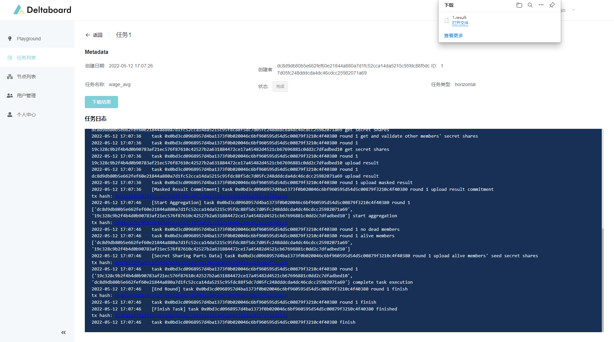
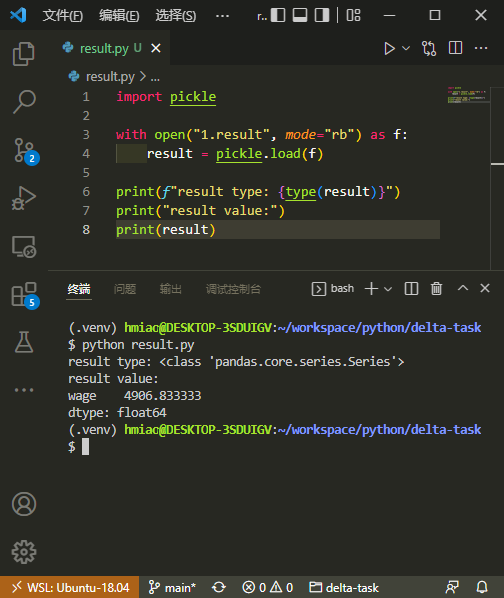

# 横向联邦统计任务

这是一个使用Delta框架编写的横向联邦统计的任务示例。

假设这样一个场景：有三家企业，每家都有一份员工工资表。这个工资表绝对不能对外暴露。现在这三家企业都在企业内部署了Delta节点，并接入了工资表的数据，我们现在要写一个数据统计任务，计算出这三家企业的全部员工的工资平均值。

> 本示例可以在Deltaboard中直接运行，完整的Jupyter Notebook文件也已经包含在Deltaboard中，进入Deltaboard的Playground，可以在examples文件下看到本示例文件。
>
> 在Deltaboard的在线版本中可以直接查看和运行这个示例
>
> [https://board.deltampc.com](https://board.deltampc.com)

### 1. 引入需要的包

```python
from delta import pandas as pd
from delta.task import HorizontalAnalytics
from delta.delta_node import DeltaNode
import delta.dataset

from typing import Dict
```

这里面比较有意思的地方是，用delta中引入的pandas替换掉了原始的pandas。完成这个替换后，原有的pandas代码保持不变，但是执行过程就被切换成Delta的隐私计算模式了。

接下来就要定义计算平均工资的统计任务了：

### 2. 定义隐私计算任务

然后可以开始定义我们的横向统计任务了，用横向联邦统计的方式，在多节点上统计我们想要的数据。

```python
class WageAvg(HorizontalAnalytics):
    def __init__(self) -> None:
        super().__init__(
            name="wage_avg",  # 任务名称，用于在Deltaboard中的展示
            min_clients=2,  # 算法所需的最少客户端数，至少为2
            max_clients=3,  # 算法所支持的最大客户端数，必须大雨等于min_clients
            wait_timeout=5,  # 等待超时时间，用来控制一轮计算的超时时间
            connection_timeout=5,  # 连接超时时间，用来控制流程中每个阶段的超时时间
        )

    def dataset(self) -> Dict[str, delta.dataset.DataFrame]:
        """
        定义任务所需的数据。
        return: 字典，键是数据的名字，需要与execute方法中的参数名称对应；值是一个delta.dataset.DataFrame实例。
        """
        return {
            "wages": delta.dataset.DataFrame("wages.csv")
        }

    def execute(self, wages: pd.DataFrame):
        """
        实现具体的统计逻辑。
        输入与dataset方法的返回值对应
        """
        return wages.mean()
```

这个任务定义分了三个部分：对数据节点的要求、数据集的选取，以及计算的逻辑。

_**任务配置**_

在 `super().__init__()` 方法中对任务进行配置。 这些配置项包括任务名称（`name`），所需的最少客户端数（`min_clients`），最大客户端数（`max_clients`），等待超时时间（`wait_timeout`，用来控制一轮计算的超时时间），以及连接超时时间（`connection_timeout`，用来控制流程中每个阶段的超时时间）。

因为网络中的节点不是一直在线的，另外也对想要参与的任务有一些挑选，所以这里定义了任务所需要的节点数量。任务发布后，节点自行选择是否加入任务，当选择加入的节点数满足了任务的要求，任务就会开始执行。

平均工资计算任务有3个节点参与，所以我们把最小和最大节点数都设置为3，要求他们全部参与。

_**数据集**_

在`dataset`方法中定义任务所需要的数据集。 该方法返回一个字典，键是数据集的名称，需要与execute方法的参数名对应；对应的值是`delta.dataset.DataFrame`实例， 其参数`dataset`代表所需数据集的名称。关于数据集格式的具体细节，请参考[这篇文章](https://docs.deltampc.com/network-deployment/prepare-data)。

数据集的定义主要是说明本次计算需要哪些数据。这些数据分散在不同的节点上，需要以同样的命名和格式保存，供Delta节点来读取使用。在未来Delta数据协议发布后，会支持更多、更灵活的数据源接入。

数据集的定义中还指定了数据读入后的格式。这里使用了delta.dataset.DataFrame，告诉Delta读入数据后，转化成Pandas的DataFrame供后续的使用。

在这里我们读入wages.csv。每个节点上的wages.csv文件里，放置的是这个企业自己员工的工资数据。

_**计算逻辑**_

在`execute`方法中实现统计计算的逻辑。`execute`方法的输入需要与`dataset`方法的返回值对应，即一个输入形参，对应`dataset`返回的字典中的一项。目前参数类型只支持`delta.pandas.DataFrame`这一种。`delta.pandas.DataFrame`的方法类似`pandas.DataFrame`，目前Delta已经支持的DataFrame操作请参考[Pandas API支持列表](../federated-analytics/pandas-api-supporting.md)。

平均工资的计算逻辑比较简单，直接使用Pandas的mean函数求平均数就可以了。

### 3. 指定执行任务用的Delta Node的API

定义好了任务，我们就可以开始准备在Delta Node上执行任务了。

Delta Task框架可以直接调用Delta Node API发送任务到Delta Node开始执行，只要在任务执行时指定Delta Node的API地址即可。

Deltaboard提供了对于Delta Node的API的封装，为每个用户提供了一个独立的API地址，支持多人同时使用同一个Delta Node，并且能够在Deltaboard中管理自己提交的任务。 在这里，我们使用Deltaboard提供的API来执行任务。如果用户自己搭建了Delta Node，也可以直接使用Delta Node的API。

在Deltaboard导航栏中进入“个人中心”，在Deltaboard API中，复制自己的API地址，并粘贴到下面的代码中：

```python
DELTA_NODE_API = "http://127.0.0.1:6704"
```

### 4. 执行隐私计算任务

接下来我们可以开始运行这个模型了：

```python
task = WageAvg().build()

delta_node = DeltaNode(DELTA_NODE_API)
delta_node.create_task(task)
```

### 5. 查看执行状态

点击执行后，可以从输出的日志看出，任务已经提交到了Delta Node的节点上。

接下来，可以从左侧的导航栏中，前往“任务列表”，找到刚刚提交的任务，点击进去查看具体的执行日志了：



可以从日志看出，在任务执行中使用了一轮链上安全聚合。可以点击对应的链接进入区块链浏览器，看到详细的transaction执行情况。在Delta的开发文档中有详细的[链上安全聚合原理介绍](../system-design/secure-aggregation-on-blockchain.md)，这里我们就不展开了。

任务执行完后，可以点击下载按钮，下载执行结果文件。执行结果就是任务中的execute方法返回的计算结果的序列化文件，可以直接用python读取使用：



从结果可以看出，我们算出了三家企业的全部员工的平均工资是4906。除了这个数字以外，我们无法知道单个企业的平均工资是多少，或者是单个员工的工资是多少。

至此，这个平均工资计算的示例就结束了。在系统详细设计的章节中，有隐私计算任务从发送到Delta Node开始，到执行完毕的详细流程说明：​


[horizontal-federated-analytics.md](../system-design/horizontal-federated-analytics.md)

