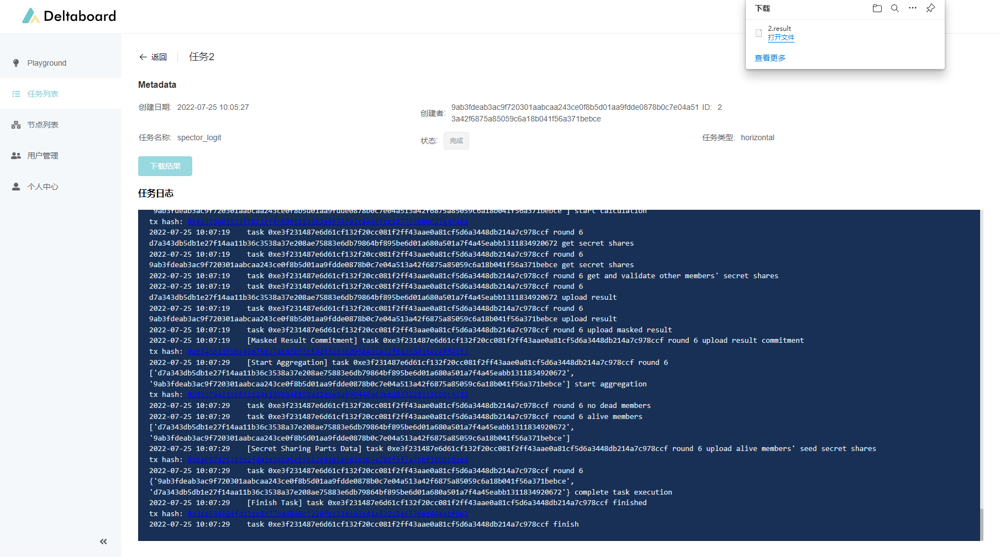
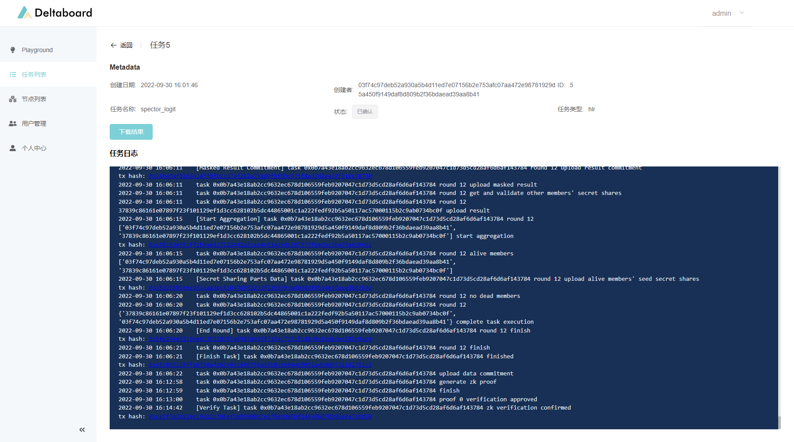

# 逻辑回归任务

这是一个使用Delta框架编写的横向逻辑回归任务示例。

数据是[spector dataset](https://www.statsmodels.org/stable/datasets/generated/spector.html)，关于个性化教学系统（PSI）计划有效性的实验数据。数据的格式是csv文件，包含4列数据，分别是GPA（平均绩点），TCUE（经济学测试分数）,PSI（是否参与个性化教学系统）和Grade（学生成绩是否提升）。任务是通过逻辑回归模型来与预测Grade（学生成绩是否提升）。

> 本示例可以在Deltaboard中直接运行，完整的Jupyter Notebook文件也已经包含在Deltaboard中，进入Deltaboard的Playground，可以在examples文件下看到本示例文件。
>
> 在Deltaboard的在线版本中可以直接查看和运行这个示例
>
> [https://board.deltampc.com](https://board.deltampc.com)

### 1. 引入需要的包

```python
import numpy as np
import pandas
import delta.dataset
from delta import DeltaNode
from delta.statsmodel import LogitTask
```

这里，我们从包`delta.statsmodel`中导入了类`LogitTask`。在Delta中定义逻辑回归任务，需要定义一个继承自`LogitTask`的子类。

接下来，我们就定义逻辑回归任务。

### 2. 定义逻辑回归任务

```python
class SpectorLogitTask(LogitTask):
    def __init__(
        self,
    ) -> None:
        super().__init__(
            name="spector_logit",  # 任务名称，用于在Deltaboard中的展示
            min_clients=2,  # 算法所需的最少客户端数，至少为2
            max_clients=3,  # 算法所支持的最大客户端数，必须大于等于min_clients
            wait_timeout=5,  # 等待超时时间，用来控制一轮计算的超时时间
            connection_timeout=5,  # 连接超时时间，用来控制流程中每个阶段的超时时间
            verify_timeout=500,  # 验证超时时间，用来控制最后零知识证明阶段的超时时间
            enable_verify=True  # 是否在任务完成后，开启零知识证明阶段
        )

    def dataset(self):
        """
        定义任务所需的数据。
        输出: 字典，键是数据的名字，需要与preprocess方法中的参数名称对应.
        """
        return {
            "data": delta.dataset.DataFrame("spector.csv"),
        }

    def preprocess(self, data: pandas.DataFrame):
        """
        预处理函数，处理数据集，将其分为特征(x)与标签(y)返回。
        输入：与dataset方法的返回值对应
        输出：特征(x)与标签(y)
        """
        names = data.columns

        y_name = names[3]
        y = data[y_name].copy()  # type: ignore
        x = data.drop([y_name], axis=1)
        return x, y
    
    def options(self):
        """
        可选方法，对逻辑回归任务的训练进行配置。
        输出：字典，逻辑回归任务的训练配置选项。
        """
        return {
            "maxiter": 35,  # 训练最大迭代次数，默认值为35
            "method": "newton",  # 训练方法，目前选项只有"newton"
            "start_params": None,  # 逻辑回归的初始权重，默认值为None。当为None时，会将权重初始化为全0
            "ord": np.inf,  # newton法相关系数。梯度范数的阶
            "tol": 1e-8,  # newton法相关系数。停止训练的容忍度
            "ridge_factor": 1e-10,  # newton法相关系数。岭回归的系数
        }
```

逻辑回归任务的定义包含了四个部分：对数据节点的要求、数据集的选取，数据集的预处理，以及训练配置。

_**任务配置**_

在 `super().__init__()` 方法中对任务进行配置。 这些配置项包括任务名称（`name`），所需的最少客户端数（`min_clients`），最大客户端数（`max_clients`），等待超时时间（`wait_timeout`，用来控制一轮计算的超时时间），以及连接超时时间（`connection_timeout`，用来控制流程中每个阶段的超时时间）。

另外，逻辑回归任务还可以在任务完成后，开启零知识证明阶段，用于验证最终结果的收敛性，以及各个节点计算过程中数据的一致性。如果要开启零知识证明，需要将`super().__init__()`中的`enable_verify`参数设置为`True`。同时，可以通过`verify_timeout`参数来控制零知识证明阶段的超时时间。目前，零知识证明阶段耗时较长，`verify_timeout`的默认值为300秒，如果在零知识证明阶段发生超时，建议适当加大`verify_timeout`。

因为网络中的节点不是一直在线的，另外也对想要参与的任务有一些挑选，所以这里定义了任务所需要的节点数量。任务发布后，节点自行选择是否加入任务，当选择加入的节点数满足了任务的要求，任务就会开始执行。

在这里，我们假设有3个节点参与逻辑回归任务，所以我们把最小和最大节点数都设置为3，要求他们全部参与。

_**数据集**_

在`dataset`方法中定义任务所需要的数据集。 该方法返回一个字典，键是数据集的名称，需要与execute方法的参数名对应；对应的值是`delta.dataset.DataFrame`实例， 其参数`dataset`代表所需数据集的名称。关于数据集格式的具体细节，请参考[这篇文章](https://docs.deltampc.com/network-deployment/prepare-data)。

数据集的定义主要是说明本次计算需要哪些数据。这些数据分散在不同的节点上，需要以同样的命名和格式保存，供Delta节点来读取使用。在未来Delta数据协议发布后，会支持更多、更灵活的数据源接入。

数据集的定义中还指定了数据读入后的格式。这里使用了delta.dataset.DataFrame，告诉Delta读入数据后，转化成Pandas的DataFrame供后续的使用。

在这里我们读入spector.csv。在每个节点上，都有自己的spector.csv文件。

_**数据预处理**_

在预处理函数中，我们需要对`dataset`方法中返回的数据集进行处理，最后返回特征（x）和标签（y）进行训练。 输入需要与`dataset`方法的返回值对应，即一个输入形参，对应`dataset`返回的字典中的一项。输出的x和y可以是`pandas.DataFrame`或`numpy.ndarray`，y必须是一个1维的向量，表示类别标签。

在这里，由于`spector.csv`包含4列，以此为GPA，TCUE,PSI和Grade，我们的任务是预测Grade，那么就以前三列为特征（x），最后一列为标签（y），对输入的`DataFrame`进行分割。初次之外，不需要其他的预处理操作。最后直接返回特征（x）与标签（y）即可。

_**逻辑回归选项**_

这个方法是可选的. 在`options`方法中，我们可以配置逻辑回归的一些参数。通用的参数包括 `method`（逻辑回顾的优化方法，目前只有`newton`可选，即牛顿法），`maxiter`（最大迭代次数，默认值35），以及`start_params`（逻辑回归的初始权重，默认值为None）。其中，`start_params`可以为`None`。`start_params`为`None`时，框架会将权重初始化为全0。

其他的参数为各个优化方法特有的。牛顿法的参数包括`ord`（梯度范数的阶，默认值为+inf），`tol`（停止迭代的容忍值，默认值为1e-8）以及`ridge_factor`（对黑塞矩阵的脊回归系数）。

上述所有的配置项，都有默认值。如果你没有特殊的需求，可以不实现这个方法，这样所有的参数都会取默认值。

### 3. 指定执行任务用的Delta Node的API

定义好了任务，我们就可以开始准备在Delta Node上执行任务了。

Delta Task框架可以直接调用Delta Node API发送任务到Delta Node开始执行，只要在任务执行时指定Delta Node的API地址即可。

Deltaboard提供了对于Delta Node的API的封装，为每个用户提供了一个独立的API地址，支持多人同时使用同一个Delta Node，并且能够在Deltaboard中管理自己提交的任务。 在这里，我们使用Deltaboard提供的API来执行任务。如果用户自己搭建了Delta Node，也可以直接使用Delta Node的API。

在Deltaboard导航栏中进入“个人中心”，在Deltaboard API中，复制自己的API地址，并粘贴到下面的代码中：

```python
DELTA_NODE_API = "http://127.0.0.1:6704"
```

### 4. 执行隐私计算任务

接下来我们可以开始运行这个模型了：

```python
task = SpectorLogitTask().build()
delta_node = DeltaNode(DELTA_NODE_API)
delta_node.create_task(task)
```

### 5. 查看执行状态

点击执行后，可以从输出的日志看出，任务已经提交到了Delta Node的节点上。

接下来，可以从左侧的导航栏中，前往“任务列表”，找到刚刚提交的任务，点击进去查看具体的执行日志了：

如果没有开启零知识证明，任务的计算阶段完成后，任务就结束了，任务状态会显示为`完成`，如下图所示



如果开启了零知识证明，则在计算阶段完成后，还会进行零知识证明阶段，零知识证明完成后，任务状态会由`完成`变为`已确认`，如下图所示



可以从日志看出，在任务执行中使用了一轮链上安全聚合。如果开启了零知识证明，还会在链上对零知识证明进行验证。可以点击对应的链接进入区块链浏览器，看到详细的transaction执行情况。在Delta的开发文档中有详细的[链上安全聚合原理介绍](../system-design/secure-aggregation-on-blockchain.md)，这里我们就不展开了。

任务执行完后，可以点击下载按钮，下载执行结果文件。执行结果包含三部分，分别是逻辑回归的权重、逻辑回归损失函数的值，以及逻辑回归训练的轮数，可以直接用python读取使用：


至此，逻辑回归的示例就结束了。
