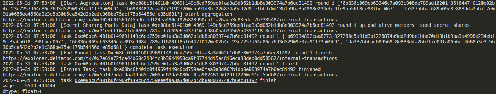

# 使用Delta Node API管理任务

Delta支持直接通过Delta Node的API来提交任务、监控任务执行状态以及获取任务执行结果。可以使用delta-task包中封装的方法来直接调用API。使用这组API，开发者可以绕过Deltaboard，直接从代码中连接Delta Node。理论上支持将Delta Task的提交和执行做为更大的运算流程中的一步来自动化运行。

在这篇文档中，我们以一个计算多个企业的平均工资的联邦统计任务为例子，描述一个完整的计算任务从编写到执行，再到获取结果的过程。

下面的示例代码可以运行在任何Python环境中，比如开发者本地的PyCharm开发环境中。只要搭建有可用的Delta Node，可以远程访问API，就可以直接执行。

在任务开发之前，需要在本地的Python环境中安装`delta-task`包。可以使用`pip`进行安装：

```
pip install delta-task
```

假设这样一个场景：有三家企业，每家都有一份员工工资表。这个工资表绝对不能对外暴露。现在这三家企业都在企业内部署了Delta节点，并接入了工资表的数据，我们现在要写一个数据统计任务，计算出这三家企业的全部员工的工资平均值。

相关的API在delta-task中对应的方法主要有如下几个：

* `create_task`：向Delta Node提交计算任务。
* `trace`：持续获取并打印Delta Node上正在执行的某个任务的执行日志，直到任务结束。
* `wait`：阻塞当前代码执行，直到Delta Node上某个任务执行完成。
* `get_result`：获取Delta Node上某个任务的执行结果。

同样的例子，使用Deltaboard来编写和执行的例子可以参考这篇文档：


[hfa-task-example.md](hfa-task-example.md)


接下来，我们在本地的Python开发环境中编写如下的代码，首先是计算任务的定义：

```python
from typing import Dict

import delta.dataset
from delta import pandas as pd
from delta.delta_node import DeltaNode
from delta.task import HorizontalAnalytics


class WageAvg(HorizontalAnalytics):
    def __init__(self) -> None:
        super().__init__(
            name="wage_avg",  # 任务名称，用于在Deltaboard中的展示
            min_clients=3,  # 算法所需的最少客户端数，至少为2
            max_clients=3,  # 算法所支持的最大客户端数，必须大雨等于min_clients
            wait_timeout=5,  # 等待超时时间，用来控制一轮计算的超时时间
            connection_timeout=5,  # 连接超时时间，用来控制流程中每个阶段的超时时间
        )

    def dataset(self) -> Dict[str, delta.dataset.DataFrame]:
        """
        定义任务所需的数据。
        return: 字典，键是数据的名字，需要与execute方法中的参数名称对应；值是一个delta.dataset.DataFrame实例。
        """
        return {
            "wages": delta.dataset.DataFrame("wages.csv")
        }

    def execute(self, wages: pd.DataFrame):
        """
        实现具体的统计逻辑。
        输入与dataset方法的返回值对应
        """
        return wages.mean()
```

这个任务定义分了三个部分：对数据节点的要求、数据集的选取，以及计算的逻辑。

数据节点的要求主要是任务所要求的最少和最多的节点数。因为网络中的节点不是一直在线的，另外也对想要参与的任务有一些挑选，所以这里定义了任务所需要的节点数量。任务发布后，节点自行选择是否加入任务，当选择加入的节点数满足了任务的要求，任务就会开始执行。

平均工资计算任务有3个节点参与，所以我们把最小和最大节点数都设置为3，要求他们全部参与。

数据集的定义主要是说明本次计算需要哪些数据。这些数据分散在不同的节点上，需要以同样的命名和格式保存，供Delta节点来读取使用。在未来Delta数据协议发布后，会支持更多、更灵活的数据源接入。

在这里我们读入`wages.csv`。每个节点上的`wages.csv`文件里，放置的是这个企业自己员工的工资数据。

数据集的定义中还指定了数据读入后的格式。这里使用了`delta.dataset.DataFrame`，告诉Delta读入数据后，转化成Pandas的DataFrame供后续的使用。

然后就是计算逻辑的编写了，这里就是传统的Pandas代码，全部复制进来就好了。计算逻辑的输入，就是上一步定义的转化后的数据集，需要几个就定义几个，全部做为execute方法的参数传递给计算逻辑。

因为隐私保护的缘故，Delta对计算逻辑有一些要求，比如必须包括聚合操作，禁止直接返回原始数据。如果遇到了不符合要求的计算逻辑，Delta就会拒绝任务执行。

平均工资的计算逻辑比较简单，直接使用Pandas的`mean`函数求平均数就可以了。

然后是将这个Task发送到Delta Node进行执行，并获取计算结果的代码：

```python

task = WageAvg().build()

DELTA_NODE_API = "http://127.0.0.1:6700"

delta_node = DeltaNode(DELTA_NODE_API)

task_id = delta_node.create_task(task)  # 创建任务

if delta_node.trace(task_id):  # 跟踪任务日志
# 如果不需要跟踪任务日志，也可以这么写：
# if delta_node.wait(task_id):  # 等待任务结束
    res = delta_node.get_result(task_id)  # 获取任务结果
    print(res)
else:
    print("Task error")
```

在指定了Delta Node API的连接地址后，通过`create_task`创建任务，就可以获得一个任务ID（`task_id`）。 后续，我们可以通过这个任务ID来对任务进行管理。

如果我们需要获取任务日志，那么可以使用`trace`这个API。`trace`会持续地在`stdout`中 打印任务日志，直至任务正常结束或发生异常。`trace`会返回一个`bool`值，如果任务正常结束， 则返回值为`True`，否则为`False`。

如果我们不需要任务日志，只需要等待任务结束，那么可以使用`wait`这个API。`wait`的用法 和返回值与`trace`一致，区别只是在于，它不会打印任务日志。

如果任务正常结束，那么我们可以通过`get_result`这个API来获取任务的结果。任务结果的类型由任务类型来决定。横向联邦学习任务，结果的类型是Dict\[str, torch.Tensor]， 即delta.task.HorizontalLearning.state\_dict()的返回类型； 横向联邦统计任务，结果的类型是delta.task.HorizontalAnalytics.execute()的返回类型（delta.pandas对应pandas）。

如果在任务没有结束或异常退出的情况下，调用`get_result`，会抛出异常。所以调用`get_result`前，一定要使用 `trace`或`wait`，等待任务正常结束。

如果任务发生异常，那么使用`trace`，可以在日志中看到发生的异常。

执行上述代码，在命令行有了如下的任务日志：



可以看到任务日志中包括了任务执行过程中的关键步骤的记录，并在最后输出了最终的平均工资计算结果。

下面是这个例子中涉及到的API方法的详细说明：

### create\_task - 创建任务

```python
delta.delta_node.DeltaNode.create_task(self, task)
```

用户可以通过该方法将任务提交到Delta Node上，创建任务。

参数：

* task: delta.core.task, 需要提交的任务，由用户编写的任务经过build生成

返回值：

* 任务ID，int类型

例子：

```python
# Example is a horizontal learning task (subclass of HorizontalLearning) or a horizontal analytics task (subclass of HorizontalAnalytics)
task = Example().build()
DELTA_NODE_API = "http://127.0.0.1:6700"
delta_node = DeltaNode(DELTA_NODE_API)
task_id = delta_node.create_task(task)
```

### trace - 跟踪任务日志

```python
delta.delta_node.DeltaNode.trace(self, task_id)
```

用户可以通过该方法，跟踪已经创建的任务的日志。该方法是阻塞方法，会持续打印任务的日志，直至任务正常结束或异常退出。

参数：

* task\_id: 已经提交的任务ID。可以通过create\_task方法得到

返回值：

* 任务状态，bool类型，True表示任务执行成功，False表示任务执行过程中出现异常

例子：

```python
# Example is a horizontal learning task (subclass of HorizontalLearning) or a horizontal analytics task (subclass of HorizontalAnalytics)
task = Example().build()
DELTA_NODE_API = "http://127.0.0.1:6700"
delta_node = DeltaNode(DELTA_NODE_API)
task_id = delta_node.create_task(task)
delta_node.trace(task_id)
```

命令行输出：

```
2022-05-24 03:43:06  start run task 0xcea03535685face8c12034c585876062915cbf01810c711c3cbb7e424f56d24a
2022-05-24 03:43:06  [Create Task] create task 0xcea03535685face8c12034c585876062915cbf01810c711c3cbb7e424f56d24a
...
...
...
2022-05-24 03:43:27  task 0xcea03535685face8c12034c585876062915cbf01810c711c3cbb7e424f56d24a finish
```

### wait - 等待任务结束

```python
delta.delta_node.DeltaNode.wait(self, task_id)
```

用户可以通过该方法，等待任务结束。该方法是阻塞方法，会阻塞直至任务正常结束或异常退出。

参数：

* task\_id: 已经提交的任务ID。可以通过create\_task方法得到

返回值：

* 任务状态，bool类型，True表示任务执行成功，False表示任务执行过程中出现异常

例子：

```python
# Example is a horizontal learning task (subclass of HorizontalLearning) or a horizontal analytics task (subclass of HorizontalAnalytics)
task = Example().build()
DELTA_NODE_API = "http://127.0.0.1:6700"
delta_node = DeltaNode(DELTA_NODE_API)
task_id = delta_node.create_task(task)
delta_node.wait(task_id)
```

### get\_result - 获取任务结果

```python
delta.delta_node.DeltaNode.get_result(self, task_id)
```

用户可以通过该方法，在任务正常结束后，获取任务结果。如果任务没有结束或执行过程中出现异常，调用此方法会抛出异常。

参数：

* task\_id: 已经提交的任务ID。可以通过create\_task方法得到

返回值：

* 任务结果。横向联邦学习任务，结果的类型是Dict\[str, torch.Tensor]，即delta.task.HorizontalLearning.state\_dict()的返回类型；横向联邦统计任务，结果的类型是delta.task.HorizontalAnalytics.execute()的返回类型（delta.pandas对应pandas）。

例子：

```python
task = Example().build()
DELTA_NODE_API = "http://127.0.0.1:6700"
delta_node = DeltaNode(DELTA_NODE_API)
task_id = delta_node.create_task(task)
if delta_node.wait(task_id):
    res = delta_node.get_result(task_id)
    print(res)
else:
    print("Task error")
```
