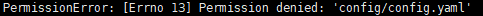
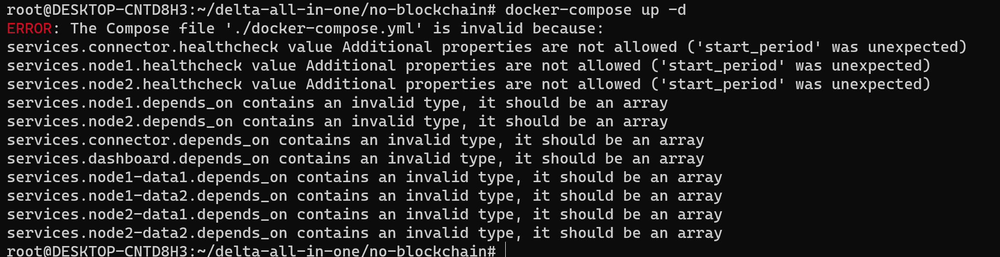

# 常见问题解答

### 1. Docker容器无法启动

如果`docker-compose up`或`docker-compose up -d`有容器无法启动，
输入命令`docker-compose ps`查看具体的容器状态，如果容器状态显示`Exit (1)`，则表明发生了异常。
常见的情况是容器`node1`、`node2`或`node3`启动失败。

这里以`node1`发生异常为例，输入命令`docker-compose logs -f node1`，查看node1的日志。
发生的异常不同，处理方式也不同。

#### 1.1. node XXX has already joined


如果遇到`node XXX has already joined`这种异常，表明上一次关闭节点时，节点没有正常退出。

以`no-blockchain`为例子。在容器`connector`运行正常的情况下，在`no-blockchain`文件夹下，依次输入命令：

```
$ docker run --rm -v ${PWD}/delta-node1:/app --network no-blockchain_default deltampc/delta-node:0.5.3 leave
$ docker run --rm -v ${PWD}/delta-node2:/app --network no-blockchain_default deltampc/delta-node:0.5.3 leave
```

然后输入命令：

```
$ docker-compose restart
```

即可重新启动。

在`with-blockchain`文件夹下，命令是类似的。需要将命令中的`no-blockchain_default`改为`with-blockchain_default`。

#### 1.2 PermissionError: [Errno 13] Permission denied: 'XXX'



如果遇到`PermissionError: [Errno 13] Permission denied: 'XXX'`这种异常，表明发生了权限问题，docker容器无法挂载volume。
这种问题一般是由于用户是root用户导致的。在非root用户的情况下，一般不会出现如下问题。

如果不能切换到非root用户，可以修改`docker-compose.yml`文件，在所有容器的配置中添加`privileged: true`。
例如：

```
  node1-init:
    image: deltampc/delta-node:0.5.3
    container_name: node1-init
    volumes:
      - "./delta-node1:/app"
    command: "init"
    privileged: true  # 新增此行
```

之后即可正常启动。

#### 1.3 service.XXX.depends_on contains an invalid type



类似上图的问题，是由docker和docker-compose版本过低引起的。需要将docker版本升级至19.03.0+，docker-compose版本升级至1.29.2+。