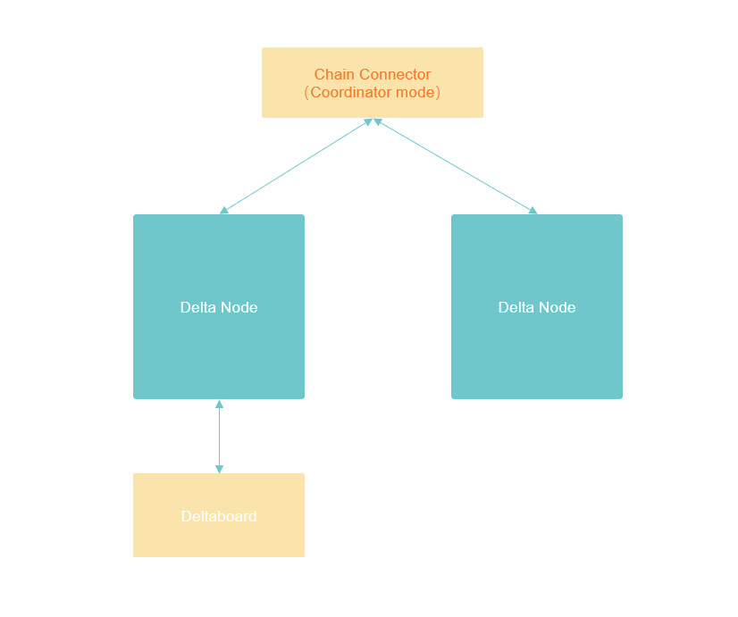
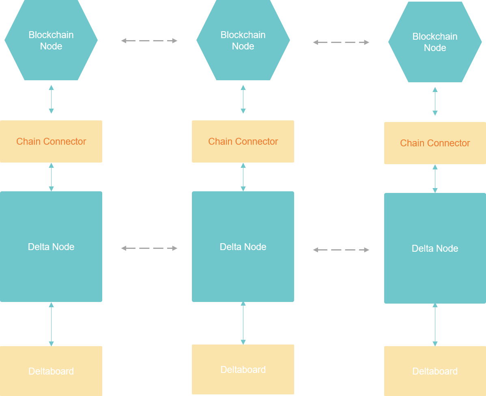

# 快速搭建指南

Delta隐私计算网络由多个组件构成，可根据需要进行选择和组合。在开始搭建前，建议先阅读系统架构说明文档，对Delta的整个框架结构有一个初步的了解：


[delta-architecture.md](delta-architecture.md)


## 无区块链网络搭建

Delta隐私计算网络支持无区块链模式的运行。这种模式下，由Chain Connector完成组网，协调Delta Node完成计算任务执行。最小化的网络需要搭建一个Chain Connector（运行于Coordinator模式），两个Delta Node，一个Deltaboard，如下图所示：





#### 使用All-in-One镜像启动整个网络

1.克隆delta-all-in-one的github仓库：

```
$ git clone --depth 1 --branch v0.5.3 https://github.com/delta-mpc/delta-all-in-one.git
```


2.进入无区块链网络的配置文件夹：

```
$ cd delta-all-in-one/no-blockchain
```


3.使用docker-compose命令启动全部的服务：

```
$ docker-compose up -d
```


4.等待Docker镜像全部下载后，服务会自动全部启动起来。等服务全部启动后，就可以开始访问Deltaboard的界面了，在浏览器里打开如下网址，可以看到Deltaboard的登录界面：

```
http://localhost:8090
```

使用Deltaboard中默认的管理员账户登录：

**用户名：admin**

**密码：admin**


5.进入Deltaboard的界面，接下来就可以在Playground中，执行计算任务了：


[run-delta-task.md](network-deployment/run-delta-task.md)




#### 使用各个组件的Docker镜像手动搭建

1.参照启动Chain Connector的教程启动Chain Connector，并配置为Coordinator模式：


[start-chain-connector.md](network-deployment/start-chain-connector.md)



2.分别启动两个Delta Node，都连接到上面配置的Chain Connector：


[start-delta-node.md](network-deployment/start-delta-node.md)



3.在Delta Node中各自放置一些测试用的数据：


[prepare-data.md](network-deployment/prepare-data.md)



4.如果不需要图形界面来管理网络、开发任务，这里我们就已经可以使用代码连接Delta Node API提交计算任务了：


[manage-task-with-delta-node-api.md](delta-task-development/manage-task-with-delta-node-api.md)



5.（可选）继续启动Deltaboard，Delta Node的图形化管理界面，以及在线代码调试环境。连接到上面配置的其中一个Delta Node：


[start-deltaboard.md](network-deployment/start-deltaboard.md)



6.（可选）至此Delta隐私计算网络已经搭建完成，接下来可以在Deltaboard中编写一个隐私计算任务试试看了：


[run-delta-task.md](network-deployment/run-delta-task.md)




## 区块链网络搭建

运行于区块链模式的Delta网络，需要至少三个数据持有方。每个数据持有方各自搭建一套完全一样的系统。系统中包括一个部署了Delta智能合约的区块链节点，运行于区块链模式的`Chain Connector`，`Delta Node`，以及用于图形化管理的`Deltaboard`。



参与网络搭建的多方也可以共享同一个区块链节点，这种情况一般用于本地测试，或者是多方之间互相信任，愿意共享同一个区块链节点。多方共享同一个区块链节点的情况下，各方的数据仍然保持同样的隐私保护程度，无数据泄露风险。只是区块链网络节点数更少，从而共识强度更低，更容易出现针对Tx的攻击行为，导致任务无法正常执行，或者是数据持有者参与了一些本不愿意参与的计算，付出了额外的算力成本。

单个区块链节点的Delta网络结构如下图所示：


在本示例中，使用上述网络结构来搭建Delta网络。

### 方法1：用Ganache做为区块链节点 <a href="#ganache_as_blockchain_node" id="ganache_as_blockchain_node"></a>

[Ganache](https://trufflesuite.com/ganache/)是一个专门用于本地测试的区块链节点，API和以太坊完全兼容，可以快速在本地搭建一个模拟以太坊的区块链节点。

注意Ganache仅仅是一个本地模拟以太坊的节点，不包括共识算法，因此绝不能用于正式环境。

在Delta All-in-One仓库中，包含了使用Ganache一键启动整个Delta网络的脚本，可以直接使用。开发者也可以自行使用各个组件的docker镜像完成网络搭建：



**使用Delta All-in-One镜像启动整个网络**

1.克隆delta-all-in-one的github仓库：

```
$ git clone --depth 1 --branch v0.5.3 https://github.com/delta-mpc/delta-all-in-one.git
```


2.进入区块链网络的启动文件夹：

```
 cd delta-all-in-one/with-blockchain
```


3.使用docker-compose命令启动全部的服务：

```
$ docker-compose up
```


等待镜像下载完成，容器就开始启动了。 当看到如下日志时：

```
dashboard       | [I 2022-01-18 09:20:40.850 JupyterHub app:2849] JupyterHub is now running at http://:8000
dashboard       | [D 2022-01-18 09:20:40.851 JupyterHub app:2452] It took 1.211 seconds for the Hub to start
```

就表明所有容器都已启动成功，我们可以访问搭建的隐私计算网络了。Delta Node镜像启动后，会自动完成链上注册，并进入任务监听状态。


4.进入Deltaboard的图形化界面：

```
http://localhost:8090
```

使用Deltaboard中默认的管理员账户登录：

**用户名：admin**

**密码：admin**

****

至此，一个三节点Delta区块链隐私计算网络，就已经搭建完成了。想要更进一步地了解Delta平台的功能、设计思路，可以浏览我们的文档：


[run-delta-task.md](network-deployment/run-delta-task.md)




**使用各个组件的Docker镜像手动搭建**

1.使用Ganache的官方镜像来启动区块链节点：

```bash
docker run -d --name=ganache -p 8545:8545 trufflesuite/ganache-cli:v6.12.2 -s delta
```

这里需要注意的是，在启动镜像时通过`-s`参数写死了随机初始化的种子，保证了第一次部署合约时，合约地址永远是一样的，以方便后续的系统配置。Ganache本来就只能用于本地测试，因此这样做也没有什么问题。


2.在区块链上部署Delta智能合约：


[deploy-smart-contracts.md](network-deployment/deploy-smart-contracts.md)


***

3\. 启动3个Chain Connector，并配置为Blockchain模式，都连接到上述区块链节点：


[start-chain-connector.md](network-deployment/start-chain-connector.md)


在配置Blockchain模式下的Chain Connector时，需要在Chain Connector的配置文件中填入一些区块链节点的信息：

`chain.nodeAddress`、`chain.privateKey`是区块链钱包的地址和私钥，Ganache在启动时会自动生成10个自带代币的钱包，可以在docker容器的日志中找到地址和私钥：

```bash
docker logs -f ganache
```

**注意3个Chain Connector必须配置成不同的钱包地址和私钥。**

`chain.provider`为区块链节点地址，在本地部署的情况下，这一项填写`ws://localhost:8545`即可。

`chain.identity.contractAddress`以及`chain.hfl.contractAddress`分别代表与Delta配套的智能合约的地址。在第2步部署智能合约完成后，我们可以得到这几个合约的地址，在这里填入配置文件中。


4.启动3个Delta Node，分别连接到上述3个Chain Connector:


[start-delta-node.md](network-deployment/start-delta-node.md)


***

***


[prepare-data.md](network-deployment/prepare-data.md)


***

6.如果不需要图形界面，就可以使用上面任意一个Delta Node的API，通过代码来提交任务，获取执行结果了：


[manage-task-with-delta-node-api.md](delta-task-development/manage-task-with-delta-node-api.md)


***

7.（可选）启动1个Deltaboard，连接到任意一个Delta Node，用于图形化的网络管理：


[start-deltaboard.md](network-deployment/start-deltaboard.md)


***

8.（可选）然后就可以在Deltaboard中编写和测试计算任务了：


[run-delta-task.md](network-deployment/run-delta-task.md)




### 方法2：用Delta Chain做为区块链节点

此种搭建方式目前只支持手动搭建的方式，可以搭建多个区块链节点组网的Delta区块链隐私计算网络。

搭建方式和[方法1](getting-started.md#ganache\_as\_blockchain\_node)中的手动搭建方式完全一致，只需要替换掉第1步。

在第1步时，按照下述步骤，启动Delta Chain镜像：

**1. 启动Delta Chain区块链节点，可以启动一个节点，也可以启动多个节点组成网络：**


[start-delta-chain-node.md](network-deployment/start-delta-chain-node.md)


**2.（可选）启动一个图形化界面的区块链浏览器，方便查看区块链数据：**


[start-delta-chain-explorer.md](network-deployment/start-delta-chain-explorer.md)


**3. 从**[**方法1**](getting-started.md#ganache\_as\_blockchain\_node)**中的\[手动搭建-第2步]继续操作。**
