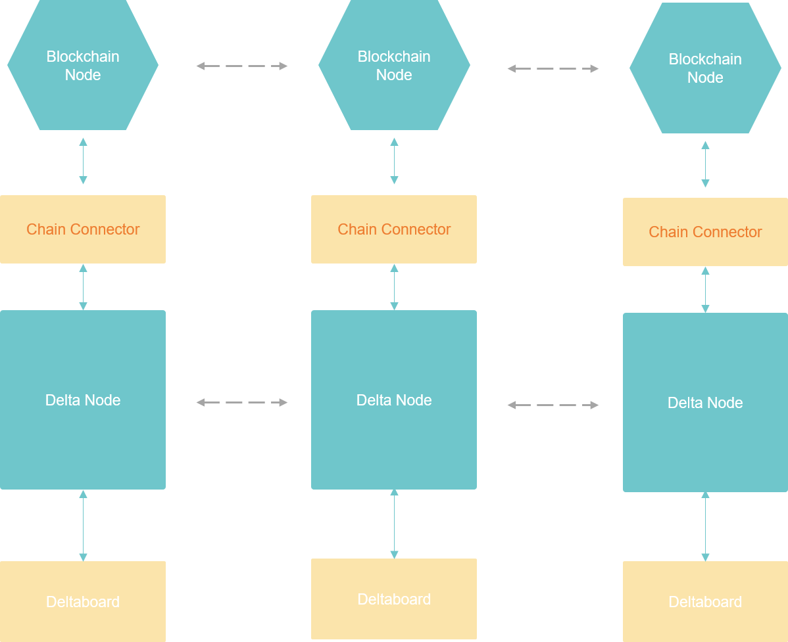
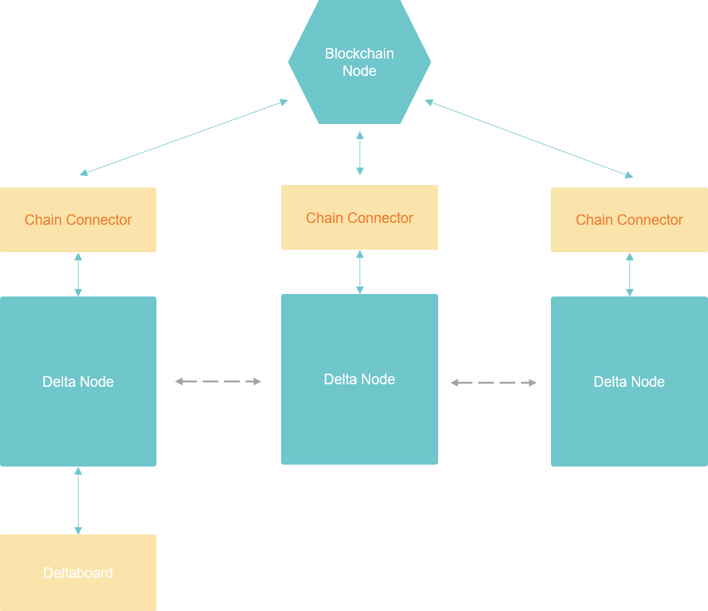

# Getting Started

Delta network is composed of several components. In different use scenarios, components could be selected and organized into different network types. Before actually deploying the system, it is better to take a look at the system architecture to have a basic understanding of the network structure and components:


[system-overview.md](system-overview.md)


## No-Blockchain Network

Delta network could be started without using Blockchain. In the `no-blockchain` mode, Delta Chain Connector acts as the coordinator of the network. All the Delta Nodes connect to the Delta Chain Connector to form the network.

A minimum Delta network in this mode requires a Delta Chain Connector, 2 Delta Nodes, and a Deltaboard which connects to one of the Delta Nodes, the network is shown in the image below:

.png>)



### **Start the network using All-in-One script**

Delta has an All-in-One startup scripts which use docker-compose to start the whole network at once.


1.Clone the Github repo:

```
$ git clone --depth 1 --branch v0.3.5 https://github.com/delta-mpc/delta-all-in-one.git
```


2.Go to the deployment folder for no-blockchain network:

```
$ cd delta-all-in-one/no-blockchain
```


3.Start all the container using docker-composer:

```
$ docker-compose up -d
```

After the downloading of all the Docker images, the service should be started normally. The network now is fully up and running.&#x20;


4.We can now visit Deltaboard to run our first Delta Task:


[run-delta-task.md](system-deployment/run-delta-task.md)




### Manually deploy the network using Docker images


1.Start the Chain Connector and configure it to run in coordinator mode:


[start-chain-connector.md](system-deployment/start-chain-connector.md)



2.Start 2 instances of Delta Node, and connect them to the Chain Connector:


[start-delta-node.md](system-deployment/start-delta-node.md)



3.Put some test data into each of the Delta Nodes:


[prepare-data.md](system-deployment/prepare-data.md)



4.If the Graphical User Interface is not required. We can already start writing codes and executing them:


[manage-delta-task-using-delta-node-api.md](delta-task-development/manage-delta-task-using-delta-node-api.md)



5.(Optional) Start Deltaboard, and connect it to one of the Delta Nodes:


[start-deltaboard.md](system-deployment/start-deltaboard.md)



6.(Optional) Now the network is fully up and running, let's try to run a computation task:


[run-delta-task.md](system-deployment/run-delta-task.md)





## Blockchain Network

To run a Delta Network in Blockchain mode, at least 3 participants are required. Each of the 3 participants should deploy a group of the same components.

The components one participant should deploy include a Blockchain Node with the Delta Contracts deployed, a Chain Connector running in Blockchain mode, a Delta Node, and a Deltaboard. The network with 3 participants is shown below:



In use cases such as local testing, or deploying a network among a limited group of participants who trust each other, the Blockchain node could be shared. All the Chain Connectors connect to the same Blockchain Node. In this case, the data is still kept private and safe for every participant. It is just with less Blockchain node, the consensus algorithm is more likely to be attacked, causing task execution failure, and the wasting of computing power for the other participants.

The network structure with one shared Blockchain node is shown in the figure below, we will deploy this network in the remaining tutorial:



### Method 1: Using Ganache as the Blockchain node

[Ganache](https://trufflesuite.com/ganache/) is a simplified Ethereum simulating Blockchain dedicated for local testing. The APIs are the same as Ethereum. We can use Ganache to start a local Ethereum node really fast.

Note that there is no multiple node consensus algorithm built into Ganache. So Ganache should never be used in a production environment.

In Delta All-in-One script repo, we have a docker compose script to start the above network using Ganache at one click. Or you can manually start the components one by one using docker images.



### **Start the network using All-in-One script**


1.Clone the Github repo:

```
$ git clone --depth 1 --branch v0.3.5 https://github.com/delta-mpc/delta-all-in-one.git
```


2.Go to the folder for blockchain network:

```
$ cd delta-all-in-one/with-blockchain
```


3.Start all the containers using docker compose:

```
$ docker-compose up 
```


When the following logs are showing up, the network is fully up and running:

```
dashboard       | [I 2022-01-18 09:20:40.850 JupyterHub app:2849] JupyterHub is now running at http://:8000
dashboard       | [D 2022-01-18 09:20:40.851 JupyterHub app:2452] It took 1.211 seconds for the Hub to start
```


4.Enter the following address in a browser to access Deltaboard:

```
http://localhost:8090
```


Now we can actually run a computation task:


[run-delta-task.md](system-deployment/run-delta-task.md)




### Manually deploy the network using Docker images

1.Using the official Ganache docker image to start the Blockchain node:

```bash
docker run -d --name=ganache -p 8545:8545 trufflesuite/ganache-cli:v6.12.2 -s delta
```

Note that we're passing a fixed random seed to the container using `-s`. By doing this, the contract addresses and wallet addresses will always be same for the first time deployment of the same contracts, which will simplify our further configuration. Since Ganache is dedicated for local testing, we're not bringing in more security risks by doing this anyway.


2.Deploy the Delta smart contracts on the Blockchain:


[deploy-smart-contracts.md](system-deployment/deploy-smart-contracts.md)



3\. Start 3 Chain Connectors, configure them to run at `blockchain` mode, and connect them all to the Blockchain node we just started:


[start-chain-connector.md](system-deployment/start-chain-connector.md)


when configuring the Chain Connectors, the config file must be filled with the right information about the wallet address and the contract address:


4\. Start 3 Delta Nodes, and connect them to each of the 3 Chain Connectors:


[start-delta-node.md](system-deployment/start-delta-node.md)



5\. If GUI is not required, we can already start running Delta Tasks in the network:


[manage-delta-task-using-delta-node-api.md](delta-task-development/manage-delta-task-using-delta-node-api.md)



6.(Optional) Start Deltaboard to manage the network and write Delta Tasks in the web interface:


[start-deltaboard.md](system-deployment/start-deltaboard.md)



7.(Optional) Write and execute Delta Tasks in Deltaboard:


[run-delta-task.md](system-deployment/run-delta-task.md)





### Method 2: Using Delta Chain as the Blockchain Node

1.Start the Delta Chain Node. We can start only one node running in test mode, and make both Chain Connectors connect to the same node. Or we can start 2 nodes to run a more complete network:


[start-delta-chain-node.md](system-deployment/start-delta-chain-node.md)


2.To check the Blockchain data more intuitively, we could start a Blockchain explorer. This step is optional:


[start-delta-chain-explorer.md](system-deployment/start-delta-chain-explorer.md)


3.Deploy the Delta Smart Contracts on Blockchain:


[deploy-smart-contracts.md](system-deployment/deploy-smart-contracts.md)


4.Start the Chain Connectors in Blockchain mode:


[start-chain-connector.md](system-deployment/start-chain-connector.md)


Then, we could following the steps in the previous section of running no-blockchain network, from step 2 to step 5, to start Delta Node and prepare the data, and finally run a Delta Task.
