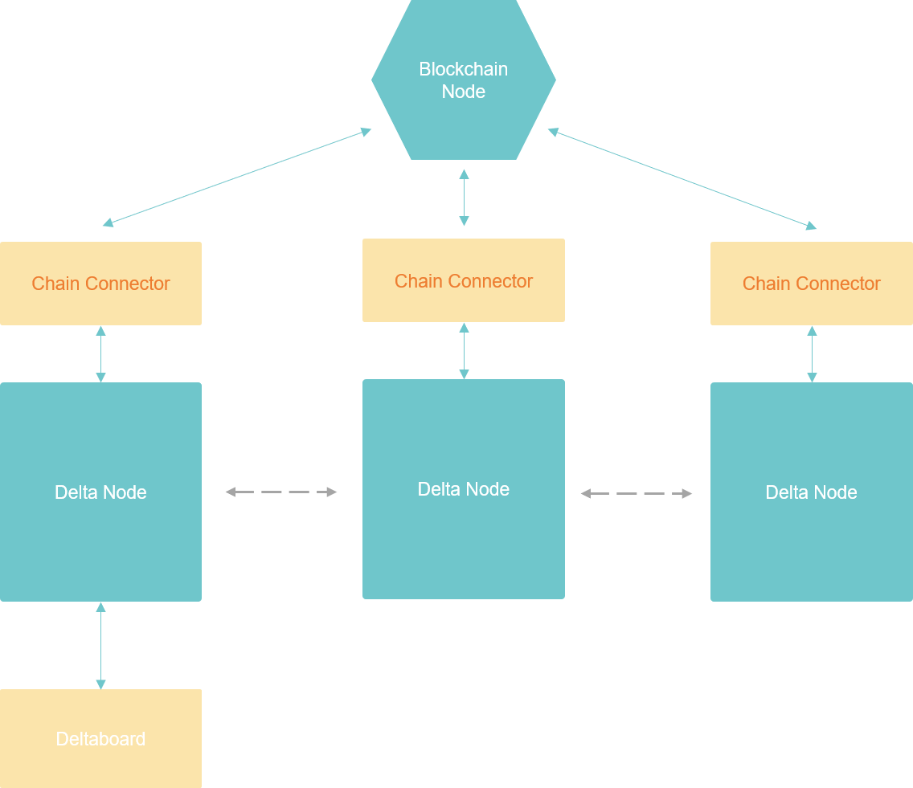

# 快速搭建指南

Delta隐私计算网络由多个组件构成，可根据需要进行选择和组合。在开始搭建前，建议先阅读系统架构说明文档，以对Delta的整个框架结构有一个初步的了解：



## 最小无区块链网络搭建

最小化的Delta隐私计算网络，需要搭建一个Chain Connector（运行于Coordinator模式），两个Delta Node，一个Deltaboard，如下图所示：


### 使用All-in-One镜像启动整个网络

Delta提供了一个docker-compose文件，用于一次启动整个网络。

1.克隆delta-all-in-one的github仓库：

```text
$ git clone https://github.com/delta-mpc/delta-all-in-one.git
```

2.进入无区块链网络的配置文件夹：

```text
$ cd delta-all-in-one/no-blockchain
```

3.使用docker-compose命令启动全部的服务：

```text
$ docker-compose up -d
```

等待Docker镜像全部下载后，服务会自动全部启动起来。等服务全部启动后，就可以开始访问Deltaboard的界面，执行计算任务了：



### 使用各个组件的Docker镜像搭建

1.参照启动Chain Connector的教程启动Chain Connector，并配置为Coordinator模式：



2.分别启动两个Delta Node，都连接到上面配置的Chain Connector：



3.在Delta Node中各自放置一些测试用的数据



4.启动Deltaboard，连接到上面配置的其中一个Delta Node：



5.至此最小化的Delta隐私计算网络已经搭建完成，接下来可以开始编写一个隐私计算任务试试看了：



## 最小完整网络搭建

一个最小的包含区块链的Delta网络，需要两个数据持有方，每个数据持有方各搭建一套完全一样的系统，包括Delta Chain Node，部署了Delta智能合约，运行于区块链模式的Chain Connector，Delta Node，以及用于图形化管理的Deltaboard。


为了简化网络，Deltaboard可以只搭建一个，区块链节点也可以只搭一个，如下图所示：



### 使用All-in-One镜像启动整个网络

Delta采用Docker镜像进行快速部署。在Delta All-in-One仓库中，包含了快速启动一个Delta网络所需要的全部启动文件和配置。

首先，我们git clone这个Delta All-in-One的仓库，目前的最新发布版本是v0.3.0：

```
$ git clone --depth 1 --branch v0.3.0 https://github.com/delta-mpc/delta-all-in-one.git
```

执行完成后，我们进入克隆下来的文件夹。delta-all-in-one中包含了两个文件夹：no-blockchain和with-deltachain。其中，no-blockchain文件夹下，是启动一个无区块链节点的Delta网络的相关配置，而with-deltachain中，是启动使用Delta Chain区块链节点的网络的相关配置。关于无区块链的Delta网络，可参考文档中的介绍：

[https://docs.deltampc.com/getting-started](https://docs.deltampc.com/getting-started)

而这里我们要搭建有区块链的版本，因此进入delta-all-in-one/with-deltachain文件夹：

```
$ cd delta-all-in-one/with-deltachain
```

在这个文件夹下，我们可以看到如下文件：

```
$ ls
connector1  connector2  connector3  deltaboard  delta-node1  delta-node2  delta-node3  docker-compose.yml
```

其中，`connector1`、`connector2`和`connector3`分别存放Chain Connector的配置：

```
$ cat connector1/config/config.json
{
  "log": {
    "level": "info"
  },
  "impl": "chain",
  "host": "0.0.0.0",
  "port": 4500,
  "monkey": {
    "db": {
      "type": "sqlite",
      "url": "db/chain.db"
    }
  },
  "chain": {
    "nodeAddress": "",
    "privateKey": "",
    "provider": "wss://apus.chain.deltampc.com",
    "gasPrice": 1,
    "gasLimit": 4294967294,
    "chainParam": {
      "chainId": 42,
      "name": "delta"
    },

    "identity": {
      "contractAddress": "0x43A6feb218F0a1Bc3Ad9d9045ee6528349572E42"
    },
    "hfl": {
      "contractAddress": "0x3830C82700B050dA87F1D1A60104Fb667227B686"
    }
  }
}
```

`chain.provider`代表区块链节点的地址，`chain.identity.contractAddress`和`chain.hfl.contractAddress`分别代表与Delta配套的智能合约的地址。为了方便大家快速地搭建，我们已经提前在我们的[Delta Chain](https://explorer.deltampc.com/)上部署好了智能合约，并填写好了这三项。当然，大家可以自行将与Delta配套的智能合约部署到其他支持以太坊虚拟机的区块链上，更改这三项配置。

在这里，我们需要填写`chain.nodeAddress`以及`chain.privateKey`，这两项分别代表用户的区块链钱包地址和私钥。用户可以使用任意与以太坊兼容的钱包（比如Metamask），来生成钱包地址和私钥。

生成了3个钱包地址和私钥后，分别将他们填入`connector1`、`connector2`和`connector3`中配置文件的`chain.nodeAddress`、`chain.privateKey`项。
这时，我们生成的钱包中还没有Deltachain的token，我们需要加入Delta的微信群，向管理员提供钱包地址，申请token。微信群的二维码可以看文末的链接。

接下来就可以启动Delta隐私计算网络了。输入命令：

```
$ docker-compose up
```

等待镜像下载完成，容器就开始启动了。
当看到如下日志时：

```
dashboard       | [I 2022-01-18 09:20:40.850 JupyterHub app:2849] JupyterHub is now running at http://:8000
dashboard       | [D 2022-01-18 09:20:40.851 JupyterHub app:2452] It took 1.211 seconds for the Hub to start
```

就表明所有容器都已启动成功，我们可以访问搭建的隐私计算网络了。Delta Node镜像启动后，会自动完成链上注册，并进入任务监听状态。

然后我们就可以进入Deltaboard的图形化界面了：

```
http://localhost:8090
```

至此，一个三节点Delta区块链隐私计算网络，就已经搭建完成了。想要更进一步地了解Delta平台的功能、设计思路，可以浏览我们的文档：



### 使用各个组件的Docker镜像搭建

1.启动区块链节点，可以启动一个区块链节点，让两个Chain Connector连接到这一个节点，也可以启动两个区块链节点组成网络，两个Chain Connector各自连接一个节点：



2.为了方便查看区块链节点的数据，可以再启动一个图形化界面的区块链浏览器，这一步可选：



3.在区块链上部署Delta智能合约：



4.启动Chain Connector，并配置为Blockchain模式：



接着，就可以按照上一节中部署无区块链网络的教程，完成Delta Node和Deltaboard的部署，准备节点数据，然后就可以运行Delta计算任务了。

