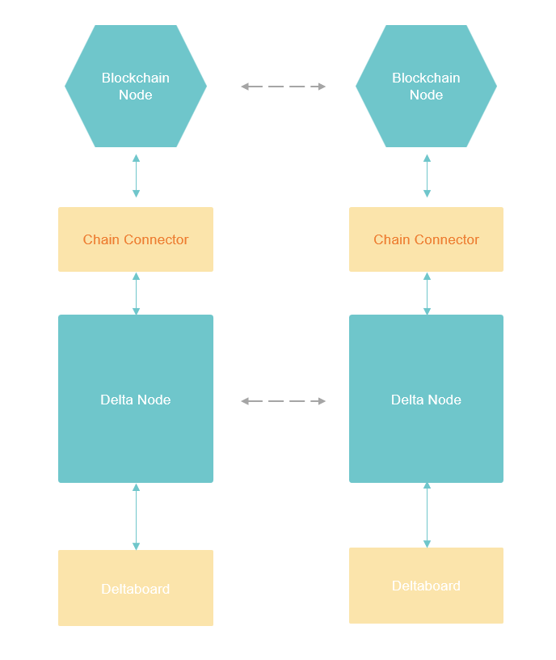
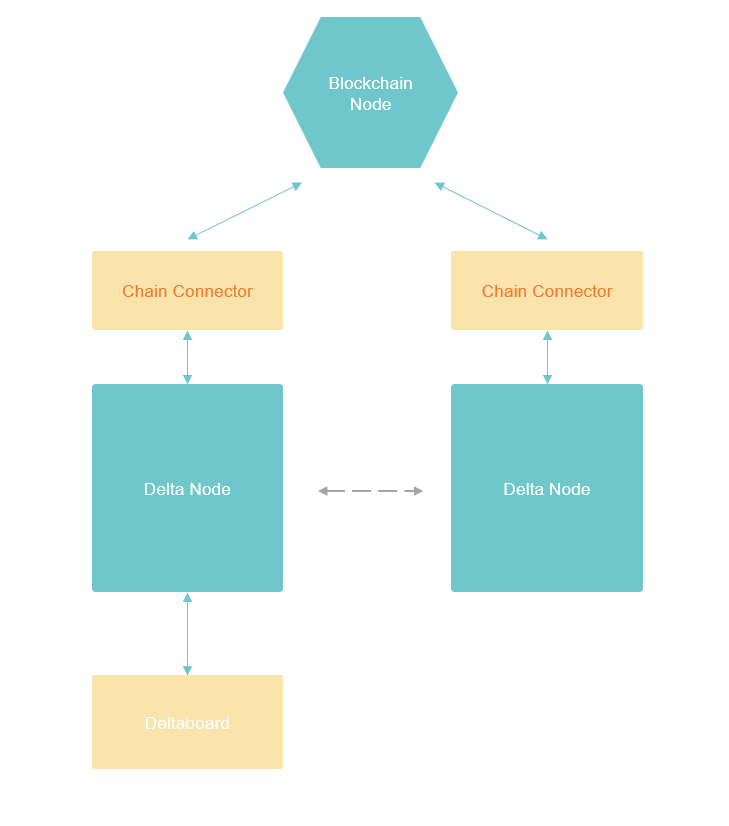

# Getting Started

Delta network is composed of several components. Based on the functions required, components could be chosen and organized to form different network types. Before the deployment, it is better to take a look at the system architecture overview to have a basic understanding of the network structure and components:



## Minimum Network without Blockchain

A minimum Delta network without Blockchain requires a Chain Connector running in coordinator mode, 2 Delta Nodes, and a Deltaboard connected to one of the Delta Nodes, as shown in the image below:


### Start the network using All-in-One Docker image

Delta has an All-in-One startup scripts using docker-compose to start the whole network at once.

1.Clone the Github repo:

```text
$ git clone https://github.com/delta-mpc/delta-all-in-one.git
```

2.Go to the config folder for no-blockchain network:

```text
$ cd delta-all-in-one/no-blockchain
```

3.Start all the container using docker-composer:

```text
$ docker-compose up -d
```

After the downloading of all the Docker images, the service should be started normally. The network now is fully up and running. We can go to Deltaboard to run our first Delta Task:



### Start the network using Docker images of the components

1.Start the Chain Connector and configure it to run in coordinator mode:



2.Start 2 instances of Delta Node, and connect them to the Chain Connector:



3.Put some test data into each of the Delta Nodes:



4.Start Deltaboard, and connect it to one of the Delta Nodes:



5.Now the network is fully up and running, let's try to run a computation task:



## Minimum Network with Blockchain

A minimum network with Blockchain consists of 2 parties deploying the same set of network components: Delta Chain Node with Delta Contracts deployed, Chain Connector running in Blockchain mode,  Delta Node, and the GUI Deltaboard, the structure is as following:



The network could be further minimized if started by a single developer. We need only one instance of Deltaboard to control the network. And the Blockchain node could be shared between the 2 Chain Connectors:



### Start the network using All-in-One Docker image

1.Clone the Github repo:

```text
$ git clone https://github.com/delta-mpc/delta-all-in-one.git
```

2.Go to the config folder for blockchain network:

```text
$ cd delta-all-in-one/with-blockchain
```

3.Start all the container using docker-composer:

```text
$ docker-compose up -d
```

After the downloading of all the Docker images, the service should be started normally. The network now is fully up and running. We can go to Deltaboard to run our first Delta Task:



### Start the network using Docker images of the components

