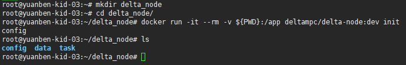

# 准备节点数据

Delta Node的Data Connector组件的开发工作量较大，目前仍在开发中。在Data Connector上线以前，我们可以采用简单的数据文件的形式向Delta Node中放置数据，用于测试整个网络的功能。

在之前启动Delta Node的教程中，使用Docker镜像启动Delta Node时，需要创建一个文件夹`delta_node`绑定到Docker容器。当Delta Node执行完初始化后，`delta_node`文件夹中会多出来几个子文件夹，其中一个`data`文件夹，就是用来放置数据文件的：



在现阶段，Delta Task支持几种固定的数据格式，比如文件夹、csv文件等。对于同一个训练任务，其需要用到的数据，必须在各个节点上以同样的格式放置。开发者在Delta Task中指定数据的文件名或者文件夹名，当这个Delta Task在网络中的其他节点上运行时，就会从这个节点的data文件夹中寻找同名文件来加载数据。

为了方便开发者上手使用，Delta Node的Docker镜像中包含了下载MNIST数据集的命令，运行下面的命令，Delta会自动下载MNIST数据集，并且随机选取1/3保留下来，删掉其他的，以模拟隐私计算网络中，多个不同的节点各自拥有不同的数据的场景：

```text
$ docker run -it --rm -v ${PWD}:/app deltampc/delta-node:dev get-mnist
```

## Delta Node支持的数据格式

在`Data`文件夹下的每一个文件或者一个文件夹，都表示一个完整的数据集

### 使用单个文件存储的全部样本

在Data文件夹下的每个文件，都表示一个完整的数据集，在文件中包含了全部的样本数据。Delta目前支持如下的文件格式：

| 文件后缀 | 文件内容 | Delta Task读取后传入Preprocess函数的参数类型 |
| :--- | :--- | :--- |
| `npy` | `numpy.ndarray` 第0维为样本的维度，即`data[0],data[1]...` 表示第0个、第1个...样本 | `numpy.ndarray` 包含单个样本的数据 |
| `npz` | `numpy.ndarray` 第0维为样本的维度，即`data[0],data[1]...` 表示第0个、第1个...样本 | `numpy.ndarray` 包含单个样本的数据 |
| `pt` | torch.Tensor第0维为样本的维度 | `torch.Tensor` 包含单个样本的数据 |
| `csv` | `,`分隔的表格，不包含标题栏，每行一个样本 | `pandas.DataFrame`包含单个样本的数据 |
| `tsv` | `\t`分隔的表格，不包含标题栏，每行一个样本 | `pandas.DataFrame`包含单个样本的数据 |
| `txt` | `\t`分隔的表格，不包含标题栏，每行一个样本 | `pandas.DataFrame`包含单个样本的数据 |
| `xls/xlsx` | Excel表格，不包含标题栏，每行一个样本 | `pandas.DataFrame`包含单个样本的数据 |

### 使用文件夹存储的全部样本

在data文件夹下放置了一个文件夹的情况下，相当于整个文件夹是一个数据集，文件里的内容分为两种情况：

#### 文件夹中包含子文件夹

在文件夹中放置的子文件夹，每个子文件夹是一个分类，子文件夹的名字就是分类的名字。子文件夹中放置的是数据文件，每个数据文件是一个样本的数据。

#### 文件夹中包含数据文件

文件夹中没有子文件夹，直接放置一个个的数据文件，在这种情况下，每个数据文件是一个样本的数据。

放置在文件夹中的数据文件，每个数据文件是一个样本的数据，数据文件的格式支持上面表格中的全部格式，区别是其文件内容中不需要额外表示样本的那个维度，和传递到Preprocess函数的数据格式是一样的。

可在文件夹中放置的单个样本数据文件，除了上面表格中列出的全部格式外，还额外支持图片格式，即一个样本数据文件可以是一张图片。支持[大部分常见的图片格式](https://pillow.readthedocs.io/en/stable/handbook/image-file-formats.html)。每一张图片作为一个样本。使用`PIL.Image.open`进行读取并传递给Preprocess函数。

