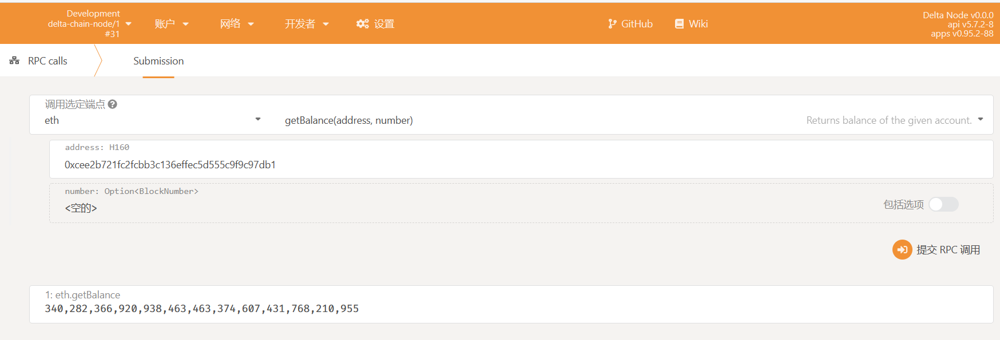
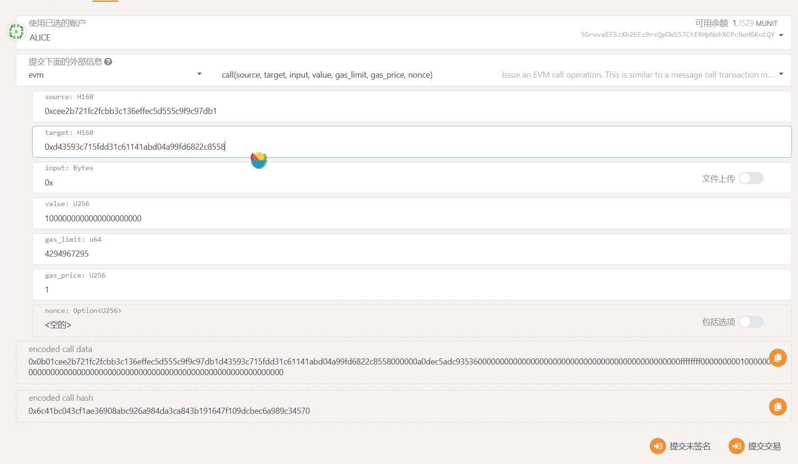

# 启动区块链节点

## 通过Docker镜像启动Delta Chain Node

推荐通过Delta Chain Node的Docker镜像来进行部署

### 下载镜像

```text
$ docker pull deltampc/delta-chain:dev
```

### 初始化配置

新建文件夹delta-node，作为节点启动的根目录

```text
$ mkdir delta-node
```

然后进入根目录

```text
$ cd delta-node
```

### 启动单节点

```text
$ docker run -d -p 9944:9944 -p 9933:9933 -v ${PWD}/data:/root/.local --entrypoint ./node --name delta-chain deltampc/delta-chain:dev --dev --ws-external
```

节点启动后，将在本机的9933端口启动rpc服务，9944端口启动websocket服务，并在根目录自动创建文件夹data，用来保存区块数据。

P.S. 如果使用Windows系统，建议使用Powershell运行上述命令，否则可能无法识别命令中的`${PWD}`变量。

### 节点交互

Delta Chain节点兼容以太坊web3标准的RPC调用

在web浏览器中打开 [Polkadot-JS Apps](https://polkadot.js.org/apps/?rpc=ws%3A%2F%2F127.0.0.1%3A9944#/explorer)，等待页面加载完成后，可以看到本地启动的节点的状态信息。


#### RPC调用

**查看余额**

1. 在Polkadot-JS Apps页面进入：开发者--&gt;RPC calls
2. 选择功能模块：eth--&gt;getBalance
3. 输入参数address: 0xcee2b721fc2fcbb3c136effec5d555c9f9c97db1
4. 点击“提交RPC调用”



可以看到在0xcee2b721fc2fcbb3c136effec5d555c9f9c97db1这个地址有预先设定好的以太余额

**转账**

1. 在Polkadot-JS Apps页面进入：开发者--&gt;RPC 交易
2. 选择账号：Alice
3. 选择功能模块：evm--&gt;call
4. 输入参数

   ```text
   source: 0xcee2b721fc2fcbb3c136effec5d555c9f9c97db1
   target: <Any eth address>
   input: 0x
   value: 1000000000000000000000 // 1000 Ether
   gas_limit: 4294967295
   gas_price: 1
   nonce: <empty>
   ```

5. 点击“提交交易”



#### 查看节点log

```text
$ docker logs -f delta-chain
```

#### 停止 & 重启节点

```text
$ docker stop delta-chain // 停止节点
$ docker start delta-chain // 启动节点
$ docker rm delta-chain // 彻底删除容器
```

## 启动多节点网络

...

