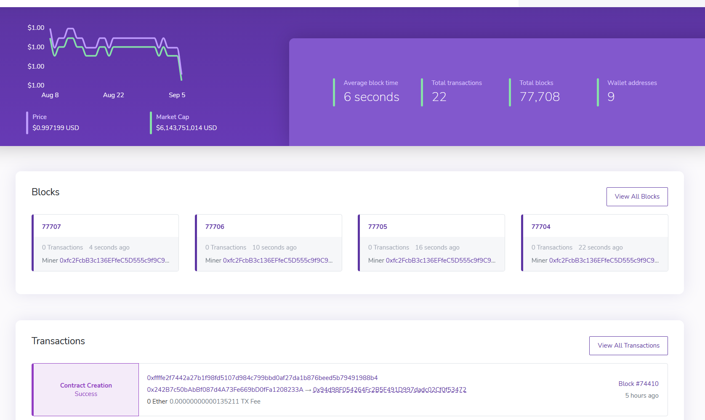

# 启动Delta区块链浏览器

## 通过Docker镜像启动区块链浏览器

推荐通过Delta Chain Explorer的Docker镜像来进行部署

### 启动Postgres数据库

区块链浏览器需要使用一个Postgres数据库来存储数据。数据分为两部分，一部分是区块数据解析后生成的索引，便于在前台快速展示历史区块的信息。另一部分是用户上传的合约数据，用于更详细的展示合约里面的内容。在区块链浏览器第一次启动时，会花一定的时间扫描历史区块，来生成索引数据。

如果数据库的数据丢失了，启动一个新的数据库，区块索引数据花一段时间就可以重建，但是用户上传的合约数据就彻底丢失了。

我们可以通过Postgres的Docker镜像来启动一个Postgres数据库供区块链浏览器使用。为了防止数据丢失，最好将持久化存储的数据放到Docker容器外部的持久化卷上保存。

在本地新建一个文件夹，做为启动数据库的跟目录：

```bash
$ mkdir postgres
```

然后用下面的命令启动postgres的镜像：

```bash
$ cd postgres
$ docker run -d -v ${PWD}/data:/var/lib/postgresql/data -e PGDATA=/var/lib/postgresql/data/pgdata -e POSTGRES_PASSWORD='1234qwer' postgres:alpine3.14
```

注意这行启动命令干了三件事情，第一个是创建`data`子文件夹，并将其绑定到容器中去，第二个是通过环境变量设置了Postgres使用的数据文件位置，第三个是通过环境变量设置了postgres默认用户的密码。

### 下载Delta区块链浏览器镜像

```bash
$ docker pull deltampc/delta-chain-explorer:dev
```

### 初始化配置

新建文件夹delta-explorer，作为节点启动的根目录：

```bash
$ mkdir delta-explorer
```

然后进入根目录，创建环境变量文件：

```bash
$ cd delta-explorer && touch .env
```

环境变量文件示例如下：

```
DATABASE_URL=postgresql://<db user>:<db password>@<db host>:<db port>/explorer?ssl=false
ETHEREUM_JSONRPC_VARIANT=ganache
ETHEREUM_JSONRPC_HTTP_URL=<RPC endponit url(http://172.17.0.1:9933)>
ETHEREUM_JSONRPC_TRACE_URL=<RPC endponit url(http://172.17.0.1:9933)>
ETHEREUM_JSONRPC_WS_URL=<Websocket endponit url(ws://172.17.0.1:9944)>
COIN=DAI
```

首先要配置数据库连接，填入数据库的用户名、密码、服务器地址和端口号。如果使用了上一节的方法来启动数据库，则用户名是`postgres`，密码是`1234qwer`，服务器地址是宿主机的IP，端口是`5432`。

另外，需要将`<RPC endpoint url>`和`<Websocket endpoint url>`地址设置为区块链节点的地址。如果使用了上一章的教程启动区块链节点，则服务的IP都是宿主机IP，RPC服务的端口是`9933`，Websocket服务的端口是`9944`。

注意上面两步中，宿主机的IP地址不是`127.0.0.1`，具体取决于操作系统：

* 对于Windows和Mac系统，请使用域名`host.docker.internal`
* 对于Linux系统，请使用`ifconfig`查看网卡`docker0`的IP地址（默认为`172.17.0.1`）

### 启动区块链浏览器的容器

```bash
$ docker run -d -p 4000:4000 --env-file ./.env deltampc/delta-chain-explorer:dev
```

在浏览器中访问地址[http://localhost:4000](http://localhost:4000)，可以看到区块链浏览器已经启动起来了：



