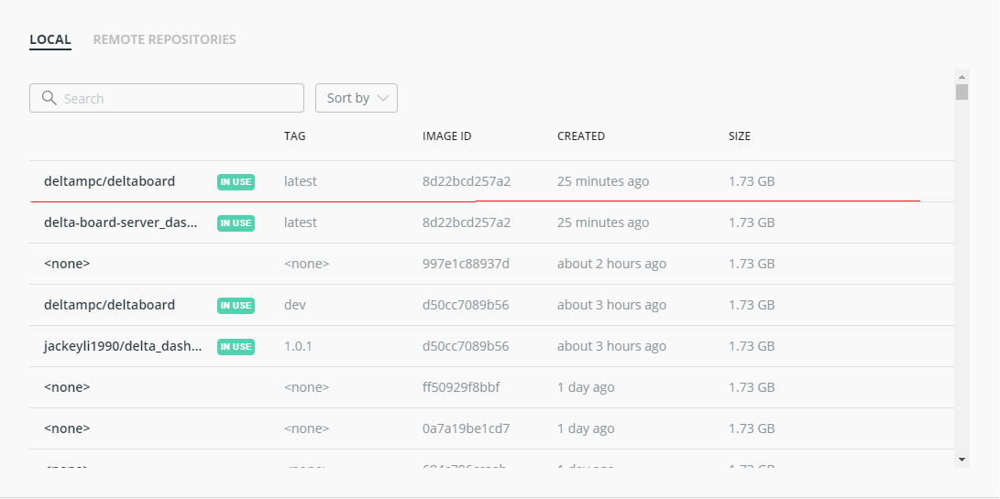
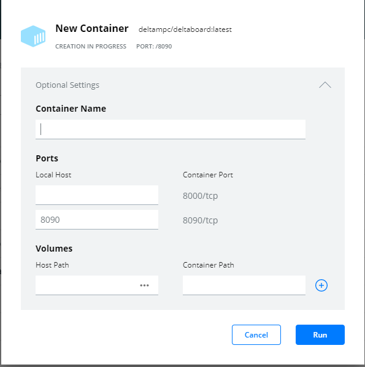
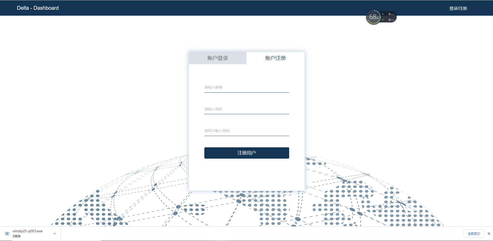

# 启动Deltaboard

## 安装Docker

docker是一个基于linux container技术的虚拟执行环境。启动deltaboard需要先安装docker,可以 ****[**访问docker官网安装Docker Desktop**](https://docs.docker.com/get-docker/)\*\*\*\*

## 下载镜像

```text
$ docker pull deltampc/deltaboard:dev
```

## **使用docker Desktop界面启动board**

### 打开docker desktop找到deltampc/deltaboard 镜像



### 点击run并配置


  

点击Run

访问http://localhost:8090

   

## **命令行启动**

```text
$ docker run -d -p 8090:8090 deltampc/deltaboard:dev
```

## 使用mysql并持久化jupyterhub data

使用无配置启动的deltaboard会将所有的改动都会保存在镜像里。如果当前镜像重新build后保存数据将丢失。您可以配置自身的数据库以将内容持久化

使用命令行运行docker

```text
docker run -d -p 8090:8090 -e CONNECTOR="${你自己的mysql连接connect_string}" -v ${本地用于存储jupyter data的folder}:/home deltampc/deltaboard 
```

