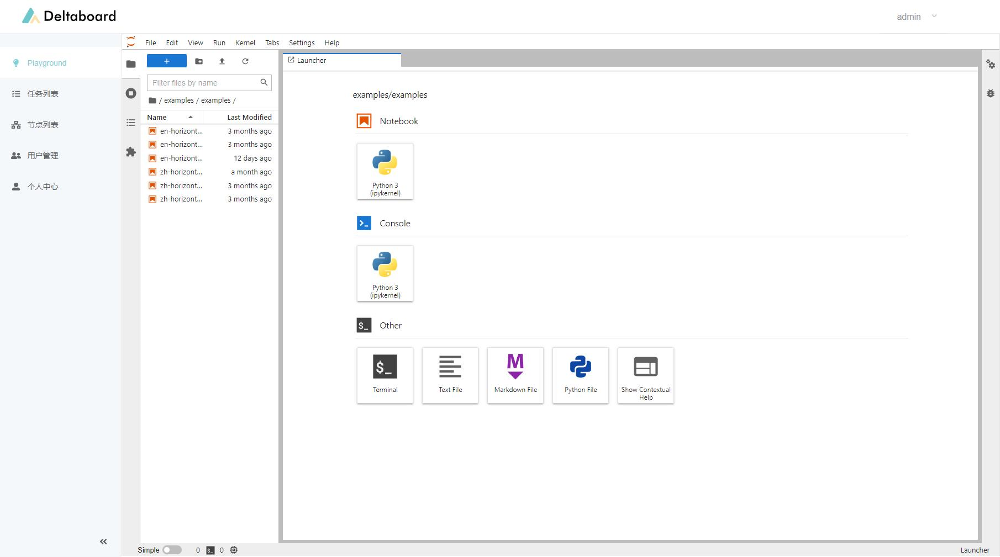
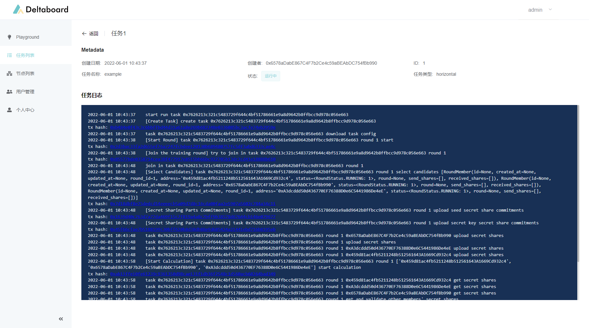

# Run Delta Task

We're finally ready to run the first Delta Task!

Delta Task could running in any environment that has Python runtime integrated. For fast testing and developing of Delta Tasks. Deltaboard has [JupyterHub](https://jupyter.org/hub) embedded in, which is basically a multi-user version of [JupyterLab](https://jupyter.org/), which is a very popular IDE among data scientists \(not among developers though, lol.\). JupyterLab supports edit and run the code directly online, and mix the code with Markdown explanations, and show the running result.

We have put an example Delta Task  inside the JupyterLab already. Go to the playground tab of the Deltaboard, there's a file named `delta_example.ipynb`. Open it and you'll see the example code:

The example Delta Task trains a neural network model to recognize handwriting digits on the public dataset MNIST. Delta node has a built-in command to prepare MNIST data, go to the following document for details if you have not:



After the data is ready, press the Run button to start the execution. From the log displayed under the code block we can confirm that the task has been successfully submitted:

 You can view the running status of the task in real time in the task list tab of Deltaboard:

The task has already started running. Click on the item, we can see the detailed running logs:

According to the log, the Delta Task is categorized as a horizontal federated learning task, and sent to the network by our Delta Node. In each training iteration, all the participating nodes uploaded the partial result in secure aggregation encrypted formats after local execution on their data. The partial data on its own can not be decrypted to reveal the gradients of a single node, it can only be used to sum up with other partial results to get a mean gradients result. Our Delta Node sums all the results up to get the final model.

Now we have successfully finished our first privacy-preserving computation task. To know more about Delta Task and write your own real computation tasks, start here by knowing more about the example code:



