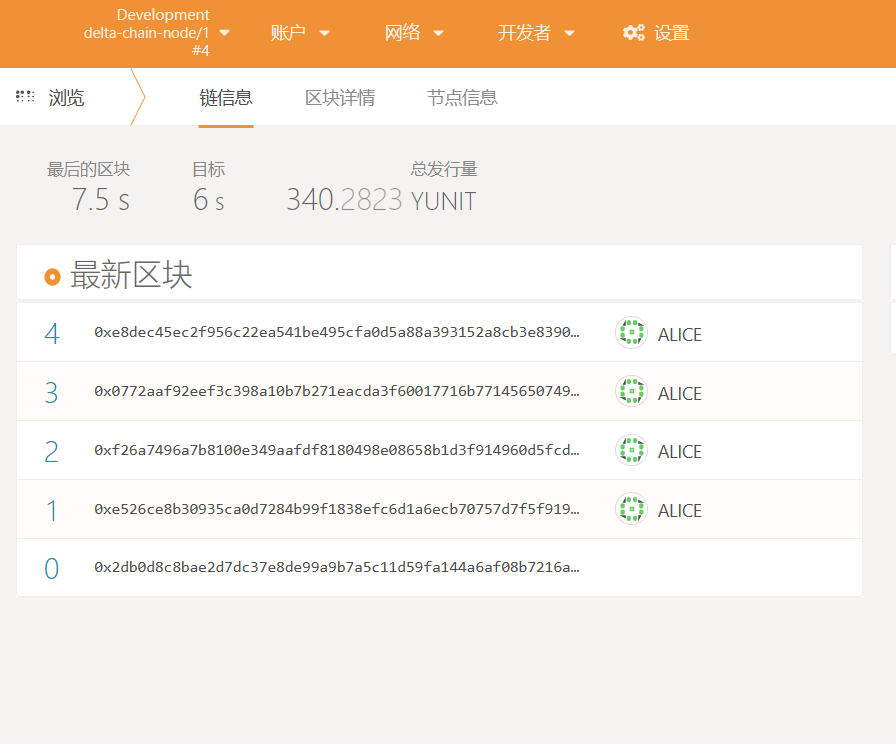

# Start Blockchain Node

## Start the Single Node Test Network

The Blockchain network is a peer-to-peer network in which every node is exactly the same. And in a Delta Network where multiple Delta Nodes are started, all the Delta Nodes could connect to a same Blockchain node without affecting the functions. Thus the developer could start a single Blockchain node test network for development purpose, which is much easier to deploy than a multiple nodes network.

The single node Delta Chain test network could be started using Delta Chain Node's Docker image:

### Download the Docker Image

```bash
$ docker pull deltampc/delta-chain:dev
```

### Initializing

Create a new folder as the root folder for Delta Chain Node and a sub folder for Blockchain data:

```bash
$ mkdir delta-chain-node
$ mkdir delta-chain-node/data
```

### Start the Container

```bash
$ cd delta-chain-node
$ docker run -d -p 9944:9944 -p 9933:9933 -v ${PWD}/data:/root/.local --entrypoint ./node --name delta-chain deltampc/delta-chain:dev --dev --ws-external
```

The Delta Chain Node will start its RPC service on port 9933, and WebSocket service on port 9944. and the \`\`\`data\`\`\` folder is used to store block data.

> If you're using Windows, the above commands should be run inside Powershell otherwise the environment variable `${PWD}` can not be recognized.

### Interacting with the Delta Chain Node

Delta Chain is built with Substrate Frontier, which is compatible with the Ethereum Web3 standard RPC protocol. So the Block explorers, the wallets of Ethereum could all be used directly.

Open [Polkadot JS App](https://polkadot.js.org/apps/?rpc=ws%3A%2F%2F127.0.0.1%3A9944#/explorer) inside a web browser, after page loading, which might take a long time, the Blockchain status will be displayed:



 

## Start the Multiple Node Network

