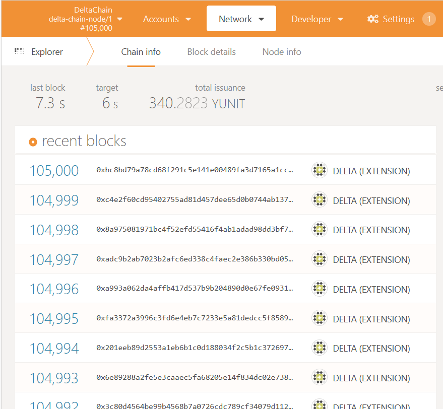
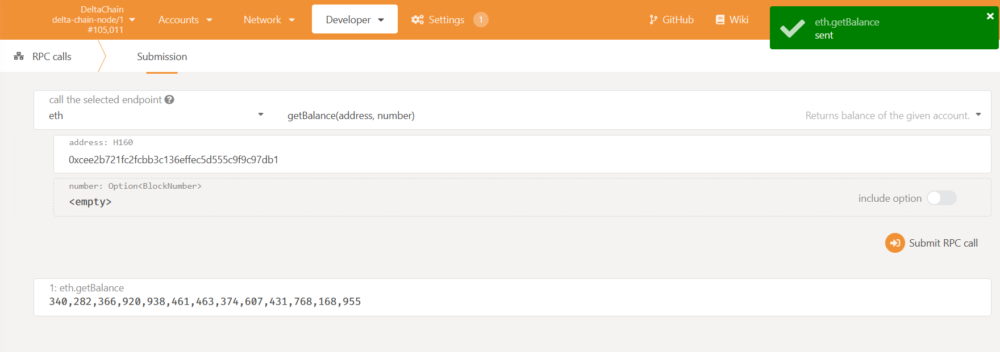
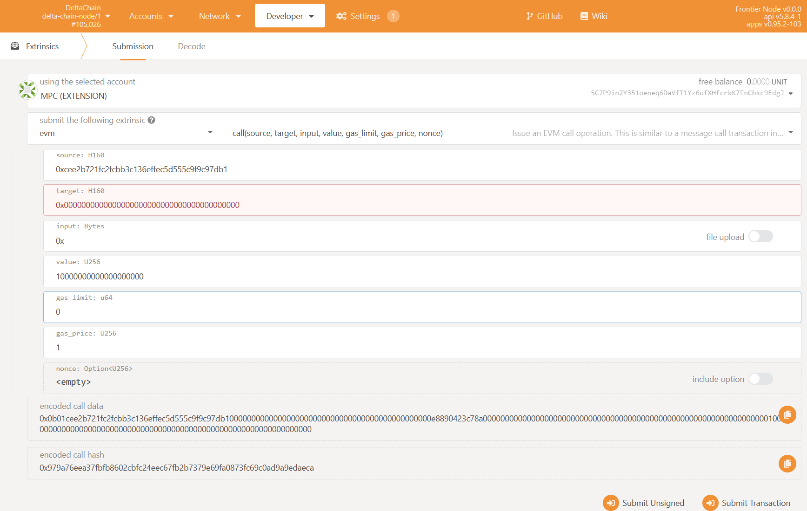

# Start Blockchain Node

## Start the Single Node Test Network

The Blockchain network is a peer-to-peer network in which every node is exactly the same. And in a Delta Network where multiple Delta Nodes are started, all the Delta Nodes could connect to a same Blockchain node without affecting the functions. Thus the developer could start a single Blockchain node test network for development purpose, which is much easier to deploy than a multiple nodes network.

The single node Delta Chain test network could be started using Delta Chain Node's Docker image:

### Download the Docker Image

```bash
$ docker pull deltampc/delta-chain:dev
```

### Initializing

Create a new folder as the root folder for Delta Chain Node:

```bash
$ mkdir delta-chain
```

### Start the Container

```bash
$ cd delta-chain
$ docker run -d -p 9944:9944 -p 9933:9933 -v ${PWD}/data:/root/.local --entrypoint ./node --name delta-chain deltampc/delta-chain:dev --dev --ws-external
```

The Delta Chain Node will start its RPC service on port 9933, and WebSocket service on port 9944. and the \`\`\`data\`\`\` folder will be created to store block data.

> If you're using Windows, the above commands should be run inside Powershell otherwise the environment variable `${PWD}` can not be recognized.

### Interacting with the Delta Chain Node

Delta Chain is built with [Substrate Frontier](https://github.com/paritytech/frontier), which is compatible with the Ethereum Web3 standard RPC protocol. So the block explorers and the wallets of Ethereum could all be used directly.

Open [Polkadot JS App](https://polkadot.js.org/apps/?rpc=ws%3A%2F%2F127.0.0.1%3A9944#/explorer) inside a web browser, after page loading, which might take a long time, the Blockchain status will be displayed:



This is a Block explorer running purely inside the browser, with no backend to store data. Every time the explorer starts, it subscribes to the Blockchain node, and displays data of newly generated blocks, there will be no displaying for old blocks. If you need a fully functional Blockchain explorer displaying all the blocks, use [Delta Chain Explorer](https://github.com/delta-mpc/delta-chain-explorer) which is built with [Blockscout](https://github.com/blockscout/blockscout), or any other explorers with a backend data storage:



#### Check Account Balance

Go to Developer tab in the navigation panel, and choose "RPC calls".

In the endpoint selection choose "eth" and "getBalance"

Input the address: `0xcee2b721fc2fcbb3c136effec5d555c9f9c97db1`, which has pre-allocated tokens when system starting. Then click "Submit RPC call":



The balance number will be returned.

#### Transfer Tokens

Go to "Extrinsics" and select "Submission". Choose Alice in the account selection. And choose "evm" and "call" as the endpoint. Input the following data:

```text
source: 0xcee2b721fc2fcbb3c136effec5d555c9f9c97db1
target: <Any eth address>
input: 0x
value: 1000000000000000000000 // 1000 Ether
gas_limit: 4294967295
gas_price: 1
nonce: <empty>
```

Click "Submit Transaction":



#### Check Logs

Logs could be viewed using Docker command:

```bash
$ docker logs -f delta-chain
```

#### Start & Stop the Node

Using Docker commands to control the Blockchain node:

```bash
$ docker stop delta-chain // Stop the node
$ docker start delta-chain // Start the node
$ docker rm delta-chain // Remove the node container
```

## Start the Multiple Node Network

