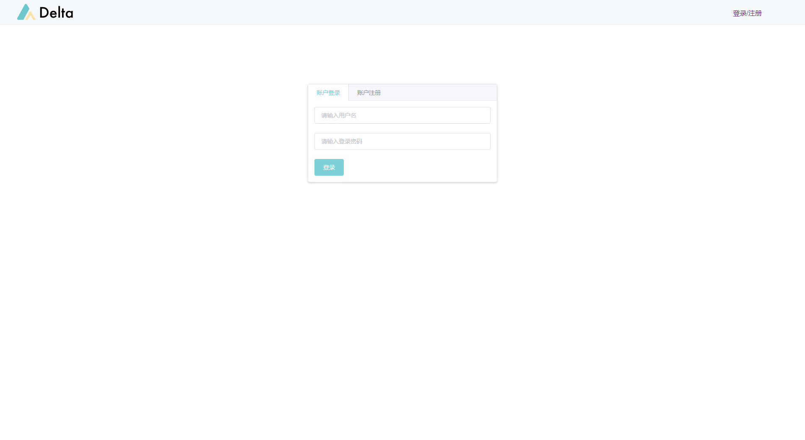

# Start Deltaboard

## Start Deltaboard by docker

We recommend to deploy Deltaboard by Docker.

### Pull Docker Image

```bash
$ docker pull deltampc/deltaboard:dev
```

### Configuration

Deltaboard need to store some data locally which includes configuration file, user data and logs, etc.. Before starting deltaboard, we need to config the board first.

Firstly, make a new directory called `deltaboard` as the root directory of the board:

```text
$ mkdir deltaboard
```

Then, in the root directory, input command:

```text
$ cd deltaboard
$ docker run -it --rm -v ${PWD}:/app deltampc/deltaboard:dev init
```

This command will create three new sub directories in the root directory, called `config`, `data` and `db`. The `config` directory is for storing configuration file, the `data` directory is for storing user data such as code in JupyterLab, and the `db` directory is for storing database file for deltaboard.

### Start Docker Container

```text
$ docker run -d --name=deltaboard -v ${PWD}:/app -p 8090:8090 deltampc/deltaboard:dev
```

### **Visit Deltaboard**

Visit [http://localhost:8090](http://localhost:8090) in the browser



When you see this login page of Deltaboard, it means the service has successfully started.

The default account for Deltaboard is:

**username: admin**

**password: admin**

Please change the password immediately after the first login.

