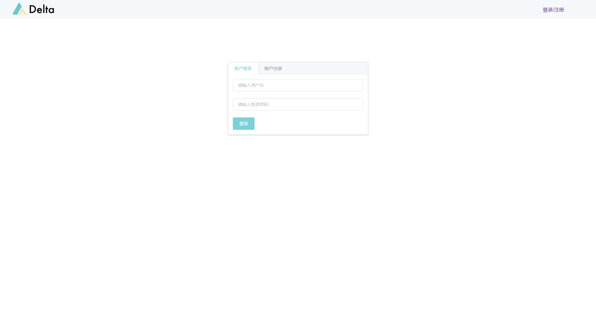

# Start the Deltaboard

## Start the Deltaboard using docker image

Deltaboard could be easily started using docker image.

### Pull the Docker Image

```bash
$ docker pull deltampc/deltaboard:0.5.3
```

### Configuration

Create a directory called `deltaboard` as the root directory to store the Deltaboard data.

```
$ mkdir deltaboard
```

In the root directory, run the following command to initialize the folder structure.

```
$ cd deltaboard
$ docker run -it --rm -v ${PWD}:/app deltampc/deltaboard:0.5.3 init
```

This command will create three sub directories in the root directory: `config`, `data` and `db`. The `config` directory is for configuration file, the `data` directory is for user data, such as the codes written in the JupyterLab, and the `db` directory is for database files of Deltaboard.

The config file must be adjusted according to the environment. Such as the address of the Delta Node.

### Start the Docker Container

```
$ docker run -d --name=deltaboard -v ${PWD}:/app -p 8090:8090 deltampc/deltaboard:0.5.3
```

### **Visit the Deltaboard**

Visit [http://localhost:8090](http://localhost:8090) in the browser



When you see this login page, the service has successfully started.

The default account for Deltaboard is:

**username: admin**

**password: admin**

Please change the password immediately after the first login.
