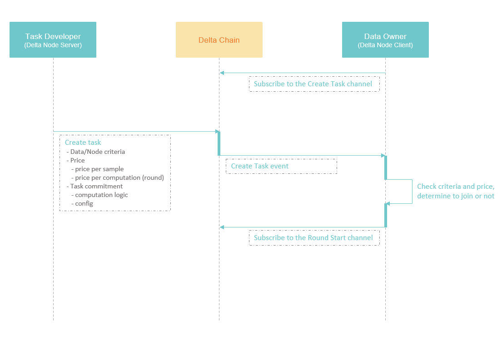
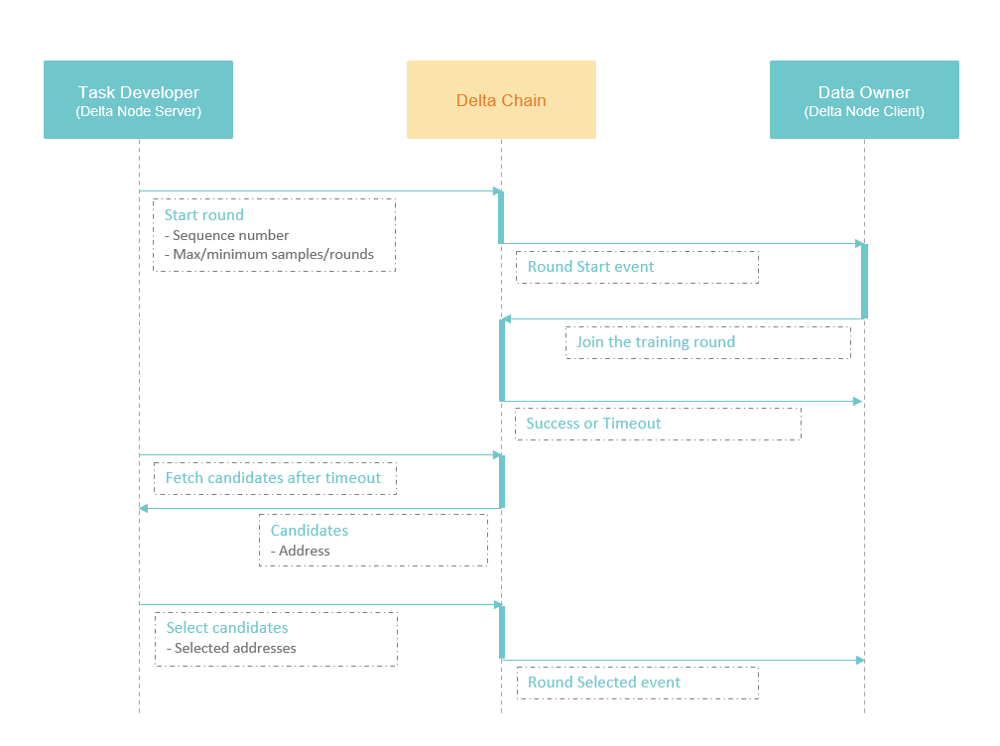
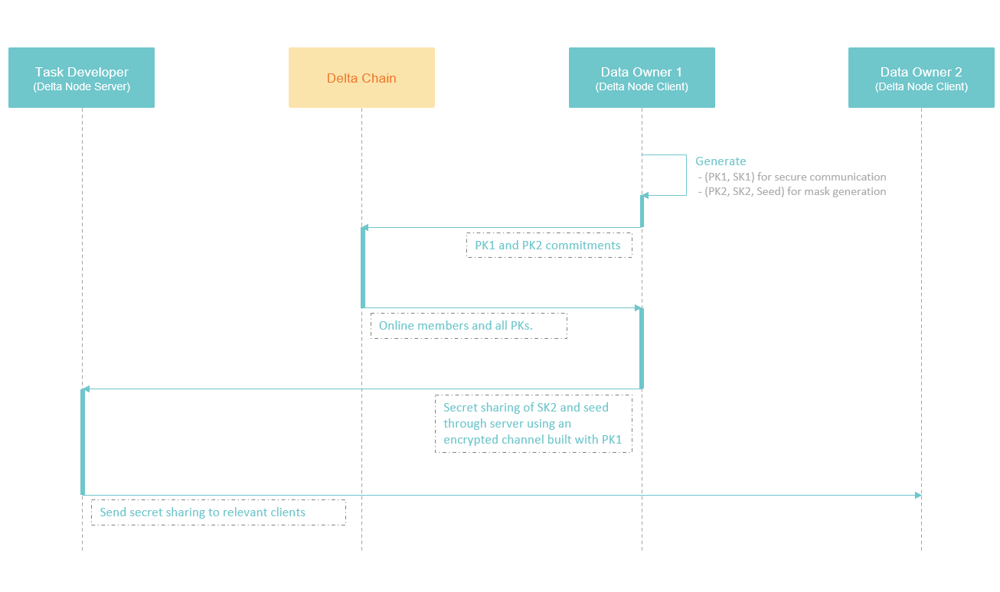
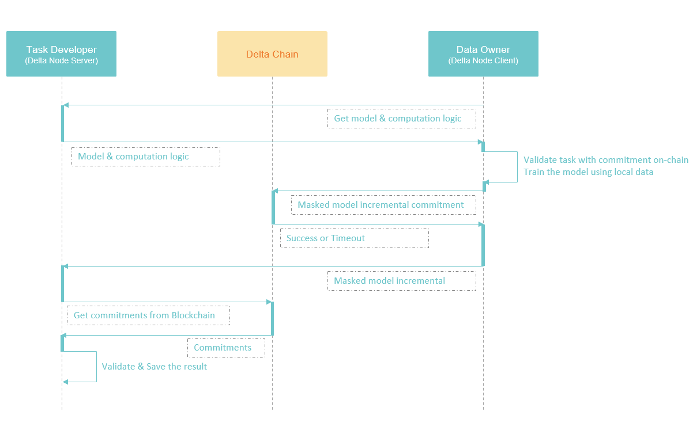
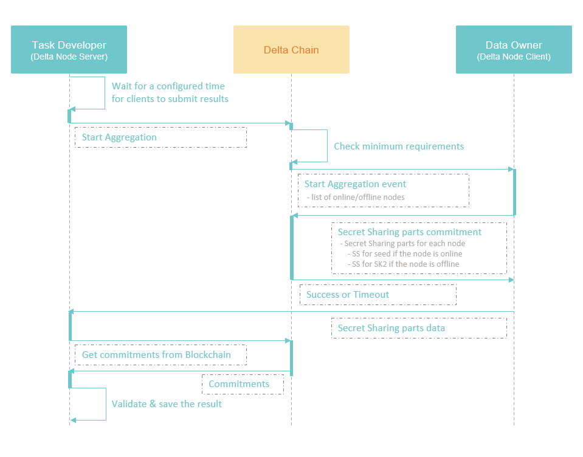

# 横向联邦学习

## 横向联邦学习算法

Delta中实现的横向联邦学习算法来自Google的经典论文：

 [Practical Secure Aggregation for Privacy-Preserving Machine Learning](https://eprint.iacr.org/2017/281.pdf)

如果需要对横向联邦学习算法有更多了解，可以阅读原始论文，或者参考下面的专栏文章：



## 横向联邦学习执行流程

Delta中的横向联邦学习的流程的设计，是使用区块链进行协调的。区块链在系统中的作用，是一个去中心化的可信结算中心，可以无需人工干预，自动完成计算任务的审计和结算。对于区块链作用的详细解释，可以参考下面这篇专栏文章：



使用零知识证明实现了计算结果的自动化验证后，区块链的作用就是对零知识证明进行校验，并在校验之后强制完成自动付款。

当然使用一个中心化的服务，也可以实现同样的功能。尤其是当使用零知识证明实现了计算过程校验后，中心化的服务也无法看到原始数据，其作用仅仅是执行一遍验证逻辑，确认无误后，完成付款。数据所有者的数据隐私性仍然得到了充分的保证。区块链和这个中心化服务相比，就是使用去中心化的多人共识来替代掉了单个服务的决策，防止这个中心化的服务由于各种原因阻碍付款，或者是在中间作弊，比如和数据所有者联合起来，让数据需求方为假的计算结果买单。

区块链也可以做为这个中心化的服务自证清白的一个手段，当数据持有者、数据需求方和中心化服务都持有了同样的整个计算流程中的关键证明数据，中心化服务可以通过这些数据来证明自己没有作弊。即中心化服务将区块链系统做为一个分布式审计系统，来对外证明自己的可靠性。

Delta目前的设计中，还不包括链上结算和付款体系，只包括计算流程中的关键证明数据的链上记录。有些关键数据包括在计算流程中，比如哪些节点加入了计算、最终是否有提交计算结果，Delta中就使用区块链来做这部分流程的协调，保证全部数据都被有效的记录。如果计算流程中不包括审计相关的关键数据，则流程的协调，就不走区块链，通过Delta Node之间的通信解决，以提高任务执行的速度。

Delta中的横向联邦学习的过程分为五步：任务注册、参与者选取、密钥交换和秘密分享、本地训练、安全聚合。

### 任务注册

在任务注册阶段，任务开发者将计算任务发布到区块链上。这里的核心是发布到区块链上的任务内容。不包括原始的计算代码，或者初始模型参数。链上只存储计算任务的零知识承诺，用于对计算任务的验证，以及后续对计算结果的验证。

任务内容包括了对于数据的需求，使用一个标准化的数据协议进行描述。以及对于节点和数据的一些其他要求。任务还需要设定一个价格，代表自己愿意为这个任务支付多少费用。数据所有者的节点通过这些要求判断自己是否加入一个计算任务。

数据所有者的节点监听区块链事件`Create Task`来获取任务，如果选择加入一个任务，则开启监听另一个计算任务轮次的事件通知`Round Start`。等待计算轮次的开启。

在任务注册阶段，数据所有者并不需要在链上报名参加任务，这是针对大规模横向联邦学习的场景的设计。很多情况下，大规模横向联邦学习的数据持有者都是移动设备，比如手机。而手机是非常容易掉线的，比如手机持有者突然进了地铁，或者是手机没电了。因此我们的流程设计不能假设同一个节点会长时间在线。而同时手机用户又特别多，总会有很多用户在线进行计算。因此Delta中的横向联邦任务以轮次做为计算节点参与的最小单位。每一轮选择一批节点，节点计算完成提交后立即结束，不要求其下一轮仍然在线。

这种设计针对少节点、单个节点多数据的企业场景也同样适用。

### 参与者选取

任务执行的基本单位轮次，一个横向联邦学习任务，可以有非常非常多的轮次，时间跨度也可以特别长。每个轮次的计算结果叠加到之前的模型上，构成一个最新的训练模型。

在每一个轮次中，任务的训练需要随机选择一批样本，用来对模型进行更新。这个随机选择体现在两个地方，一个是每个轮次会随机选择一批计算节点，另一个是每个计算节点在执行本地训练时，也会随机从本地选择训练样本。

在每个轮次中选择计算节点的设计，也是考虑手机客户端的场景。单个手机客户端的数据量相对较小，但是手机客户端的数量是很大的，因此为了保证每轮训练能使用到不同的样本，加入了对手机客户端的选择。在企业节点的场景下，节点数较少，单个节点的数据量较大，服务端可以设置在每个轮次中都选中全部的节点，把随机选样本的任务完全代理给计算节点。

任务发起者在链上发出开启轮次的事件`Round Start`，接收到事件的计算节点调用智能合约报名参加，等待一定时间后，报名结束，任务发起者在报名的节点中随机选择一批，参与本轮的计算。

由于计算节点会随时掉线，因此Delta的设计原则是保证单轮运算的时间尽量短。因此这里的等待时间必须严格控制，防止节点加入轮次后掉线。

### 密钥交换和秘密分享

### 本地训练

### 安全聚合

