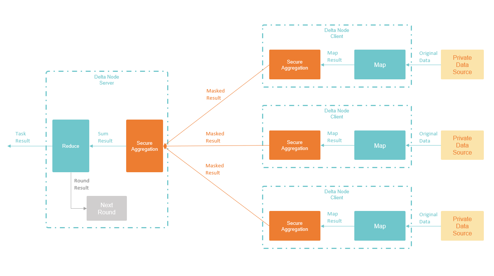

# 横向联邦任务框架

Delta中的横向联邦任务包括了联邦学习和联邦统计两种。联邦学习用于机器学习模型的训练，联邦统计用于计算数据集的统计结果。虽然两种任务类型的计算的内容区别很大，但是计算的流程是类似的。在Delta中，两种任务都是按照统一的横向联邦任务框架执行。本文首先介绍抽象的联邦任务执行的统一框架，然后再针对具体的联邦学习和联邦统计两种任务，分别介绍其在联邦任务执行框架下不同的实现方式。

### 抽象的联邦任务计算流程

横向联邦任务框架将一个计算任务表示为多个计算单元的组合，每个计算单元称为一轮（`Round`），每一轮都是完全独立的计算，参与者要在这一轮开始时选择是否加入计算，并执行本地计算，然后将本地生成的用于安全聚合的结果发送到任务发起方，由任务发起方完成最终的计算结果生成。

Delta的横向联邦任务框架参考了`MapReduce`的计算流程，每个计算单元`Round`包括`Select`，`Map`，`Aggregate`，`Reduce`四步。

#### Select - 参与者选取

Delta Task的定义中，包括对参与计算的节点数的限制，比如最少需要几个节点，最多允许几个节点。因此在执行任务之前，需要节点报名参加计算，然后任务发起者在报名者中选择符合条件的参与者，进入到下一步的计算中。

在Delta的设计中，参与者选取在每一个最小计算单元，一个`Round`，进行前都要重新进行一次。这是因为一个任务一般会包含很多个`Round`，整个计算流程需要的时间很长。这个过程中，可能有客户端会突然下线（如果客户端是手机，这种情况很常见）， 也有客户端会在任务中途上线。那么，只在任务开始时select一次，就会导致流程中不断有节点掉线，参与者越来越少，任务就无法执行下去了。所以我们选择在每个`Round`开始时都进行一次`Select`操作。这样每个客户端的压力小了很多，不再需要保持长时间的在线，同时对于任务发起者而言，也不会出现任务执行过程中，客户端越来越少的情况。

Select结束后，就开始进行正式的计算了，计算的几个步骤如下图所示：

#### Map - 本地计算

确定了本轮计算的参与者后，本轮计算就正式开始了。在第一个阶段`Map`中，Delta Task的执行逻辑和`MapReduce`中的`Map`是一致的。各个节点在本地数据集上各自完成任务定义中的计算逻辑，得到本地的计算结果。

Map中的计算逻辑完全在节点本地执行，得到的计算结果也不会对外发送，数据仍然是安全的。

#### Aggregate - 安全聚合

在`Aggregate`阶段，各个节点通过安全聚合算法，生成本地数据的可对外分享结果。这一步的核心是保证每个节点对外分享的结果，无法反推出任何私密的原始数据或者原始统计结果。只有将多个节点的数据求和，得到多个节点的联合统计结果。

`Aggregate`阶段对应于`MapReduce`中的`Shuffle/Sort`阶段。在`MapReduce`的流程中，这一步是节点间交换原始数据，对数据进行排序，为下一步的结果聚合做准备。但是在Delta的任务执行中，为了保证单个节点的数据隐私，不能在节点间直接交换数据，这一步只能通过加密的安全聚合算法，得到`Map`阶段执行结果的全节点求和。然后将求和结果用于下一步的`Reduce`阶段。

以最粗略的方式来看安全聚合的流程，就是各个节点对自己的`Map`计算结果进行一个特殊的"掩码/加密"操作，然后发送给任务发起方。任务发起方收到所有节点的掩码结果进行相加，就得到了多节点原始数据的求和结果。

Delta中的安全聚合使用了区块链进行任务协调，以保证计算结果的可信性。详细的链上安全聚合流程，请参考这篇文章：


[secure-aggregation-on-blockchain.md](secure-aggregation-on-blockchain.md)


#### Reduce - 结果生成

在上一步的安全聚合中，任务发起者拿到了各方的数据进行求和后的结果。最后的步骤，就是任务发起方自己执行Reduce步骤，完成最终计算结果的生成。这一步也和`MapReduce`中的`Reduce`步骤一致。

### 使用横向联邦任务框架实现Delta Task

在Delta中，开发者无需自行使用横向联邦任务框架来实现计算任务，而是使用Delta封装好的更高级的Delta Task来编写任务代码。当开发者将写好的Delta Task发送到Delta Node执行节点后，Delta Node会对Delta Task进行处理，根据Task的类型和内容，自动按照横向联邦任务框架进行转化，根据代码确定需要执行的轮次数，并生成对应的各阶段执行代码。

横向联邦任务有两类，联邦学习任务和联邦统计任务，对应的Delta Task也有两种不同的实现方式。具体的Delta Task如何映射为Round中的各阶段，请参考下面的详细介绍：

横向联邦学习任务的实现：


[horizontal-federated-learning.md](horizontal-federated-learning.md)


横向联邦统计任务的实现：


[horizontal-federated-analytics.md](horizontal-federated-analytics.md)

