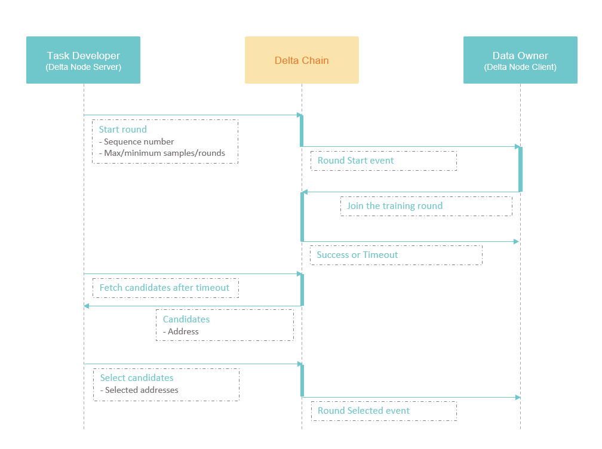
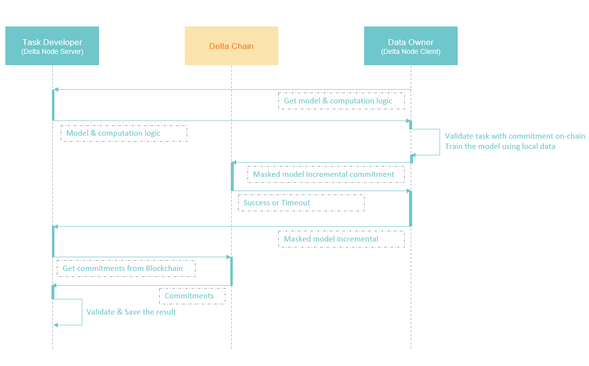

# 链上安全聚合

## 安全聚合算法

Delta中实现的安全聚合算法来自Google的经典论文：

 [Practical Secure Aggregation for Privacy-Preserving Machine Learning](https://eprint.iacr.org/2017/281.pdf)

如果需要对安全聚合算法有更多了解，可以阅读原始论文，或者参考下面的专栏文章：



## 链上安全聚合的意义

整体上来看，无论是联邦学习还是联邦统计，都是把计算模型或代码，分发到各个不同的持有数据的终端上，在数据终端上进行计算，然后再将各个终端上的计算结果进行聚合，
得到全局的计算结果。对计算结果进行聚合时，如果直接使用明文，有可能会泄露用户数据的隐私，带来安全隐患，所以我们必须使用一种方法，
能够在不暴露各端计算结果明文的同时，得到正确的聚合结果。这就时安全聚合。

对于联邦学习和联邦统计来说，安全聚合是保证安全的核心。通过安全聚合，联邦学习和联邦统计才能够安全地使用多方的数据，共同进行模型训练，或者统计计算。

一般来说，安全聚合算法，都需要一个中心化的服务器，用来对协调算法中的各个参与方，并进行最终的聚合结果的计算。
由于这个服务器是中心化的，对外并不透明，所以在半诚实的安全模型下，并不能防止服务器与一些参与方进行串谋，来窃取其他参与方的信息。
这就增加了一层信任的成本，也就是说，其他数据持有者必须要信任这个中心化的服务器，才会参与到联邦学习与联邦统计中来。

所以，我们想要在Delta中，使用区块链来代替这个中心化服务器的功能，使用去中心化的信任模式，来降低之前中心化的模式下的信任成本。

在Delta中，安全的聚合的整个流程，是使用区块链进行协调的。区块链在系统中的作用，是一个去中心化的可信结算中心，可以无需人工干预，自动完成计算任务的审计和结算。对于区块链作用的详细解释，可以参考下面这篇专栏文章：



使用零知识证明实现了计算结果的自动化验证后，区块链的作用就是对零知识证明进行校验，并在校验之后强制完成自动付款。

使用区块链来代替一个中心化的服务器，优势在于公开、透明，同时更加安全。尤其是当使用零知识证明实现了计算过程校验后，中心化的服务也无法看到原始数据，其作用仅仅是执行一遍验证逻辑，确认无误后，完成付款。数据所有者的数据隐私性仍然得到了充分的保证。区块链和这个中心化服务相比，就是使用去中心化的多人共识来替代掉了单个服务的决策，防止这个中心化的服务由于各种原因阻碍付款，或者是在中间作弊，比如和数据所有者联合起来，让数据需求方为假的计算结果买单。

区块链也可以做为这个中心化的服务自证清白的一个手段，当数据持有者、数据需求方和中心化服务都持有了同样的整个计算流程中的关键证明数据，中心化服务可以通过这些数据来证明自己没有作弊。即中心化服务将区块链系统做为一个分布式审计系统，来对外证明自己的可靠性。

Delta目前的设计中，还不包括链上结算和付款体系，只包括计算流程中的关键证明数据的链上记录。有些关键数据包括在计算流程中，比如哪些节点加入了计算、最终是否有提交计算结果，Delta中就使用区块链来做这部分流程的协调，保证全部数据都被有效的记录。如果计算流程中不包括审计相关的关键数据，则流程的协调，就不走区块链，通过Delta Node之间的通信解决，以提高任务执行的速度。

## 安全聚合的执行流程

Delta中的安全聚合的流程可以分为五步：任务注册、参与者选取、密钥交换和秘密分享、本地计算、数据聚合。

### 任务注册

在任务注册阶段，任务开发者将计算任务发布到区块链上。这里的核心是发布到区块链上的任务内容。不包括原始的计算代码，或者初始模型参数。链上只存储计算任务的零知识承诺，用于对计算任务的验证，以及后续对计算结果的验证。

任务内容包括了对于数据的需求，使用一个标准化的数据协议进行描述。以及对于节点和数据的一些其他要求。任务还需要设定一个价格，代表自己愿意为这个任务支付多少费用。数据所有者的节点通过这些要求判断自己是否加入一个计算任务。

数据所有者的节点监听区块链事件`Create Task`来获取任务，如果选择加入一个任务，则开启监听另一个计算任务轮次的事件通知`Round Start`。等待计算轮次的开启。

在任务注册阶段，数据所有者并不需要在链上报名参加任务，这是针对大规模横向联邦学习的场景的设计。很多情况下，大规模横向联邦学习的数据持有者都是移动设备，比如手机。而手机是非常容易掉线的，比如手机持有者突然进了地铁，或者是手机没电了。因此我们的流程设计不能假设同一个节点会长时间在线。而同时手机用户又特别多，总会有很多用户在线进行计算。因此Delta中的横向联邦任务以轮次做为计算节点参与的最小单位。每一轮选择一批节点，节点计算完成提交后立即结束，不要求其下一轮仍然在线。

这种设计针对少节点、单个节点多数据的企业场景也同样适用。

### 参与者选取

任务执行的基本单位轮次，一个横向联邦学习任务，可以有非常非常多的轮次，时间跨度也可以特别长。每个轮次的计算结果叠加到之前的模型上，构成一个最新的训练模型。

在每一个轮次中，任务的训练需要随机选择一批样本，用来对模型进行更新。这个随机选择体现在两个地方，一个是每个轮次会随机选择一批计算节点，另一个是每个计算节点在执行本地训练时，也会随机从本地选择训练样本。

在每个轮次中选择计算节点的设计，也是考虑手机客户端的场景。单个手机客户端的数据量相对较小，但是手机客户端的数量是很大的，因此为了保证每轮训练能使用到不同的样本，加入了对手机客户端的选择。在企业节点的场景下，节点数较少，单个节点的数据量较大，服务端可以设置在每个轮次中都选中全部的节点，把随机选样本的任务完全代理给计算节点。

任务发起者在链上发出开启轮次的事件`Round Start`，接收到事件的计算节点调用智能合约报名参加，等待一定时间后，报名结束，任务发起者在报名的节点中随机选择一批，参与本轮的计算。

由于计算节点会随时掉线，因此Delta的设计原则是保证单轮运算的时间尽量短。因此这里的等待时间必须严格控制，防止节点加入轮次后掉线。

### 密钥交换和秘密分享

Google的横向联邦学习算法中，通过一组密钥交换实现节点间的加密通信，通过另一组密钥的秘密分享来实现对于节点掉线的容错，通过一个额外的随机数的秘密分享，实现对于服务端作弊获取单节点明文计算结果的防御。

在原始的算法中，这一步的秘密分享是放在模型的本地训练之后进行的，做为安全聚合的一部分。而在Delta中，在一个交易体系的框架下，大量消耗算力的模型训练步骤被置后了。因为节点很容易掉线，而太多节点掉线会导致本轮任务执行失败，这样节点的算力消耗就浪费了。因此Delta在“尽早失败”的设计原则下，将其他操作尽可能提前，一旦失败，就不需要执行模型训练，帮助节点节省计算资源。

在运行Delta Node客户端的是手机的情况下，由于手机之间的通信不可靠，因此手机之间的秘密分享，通过Delta Node服务端进行中转。如果是企业级的Delta Node，则秘密分享可以直接通过节点间的二级通信网络进行。节点间通信使用第一组密钥PK1/SK1进行密钥交换，然后使用交换的密钥进行对称加密，保证通信数据无法被服务器监听。

### 本地计算

接着Delta Node客户端开始在本地的数据集上运行计算任务。由于链上没有计算逻辑的代码和数据，因此节点需要先连接Delta Node的服务端获取计算代码，以及本轮计算所需的数据。节点通过链上提交的计算任务零知识承诺来验证计算逻辑和计算任务的匹配，防止计算节点给出其他的计算任务，欺骗计算节点。

这里Delta Node客户端从服务端获取了两样东西，计算代码和计算所需的数据。计算代码的表现形式是Python序列化后的Delta Task计算任务。在服务端注册任务时，已经将Delta Task对应的零知识承诺提交上链，因此这一步Delta Node客户端从链上获取零知识承诺，通过零知识承诺验证收到的Delta Task的正确性。

计算所需的数据包括联邦学习中模型的参数、联邦统计中通过安全聚合得到的中间结果、用户在代码中定义的常量、字面量等数据。Delta Node客户端不需要验证这些数据的正确性。在每轮安全聚合结束后，Delta Node服务端也并没有将聚合后得到的结果上链。因为这些数据对于整个计算任务的成功执行和结算来说没有作用，客户端也不关心数据是什么，只要在服务端给出的数据上，执行完计算逻辑即可。

> 未来，如果Delta Node服务端用训练好的模型对外提供预测服务，如果需要证明自己提供的预测的正确性，可以在这里加上单轮次训练结果的零知识承诺上链，把整个训练过程和预测过程连接起来，以证明自己的预测服务的模型，是经过了足够多的数据的训练得到的。

计算节点完成计算任务后，将Mask过的计算结果的零知识承诺发送到区块链存储，用于后续的任务校验和结算。然后将Mask过的计算结果发送回服务器端，服务器端同样需要通过区块链上的零知识承诺校验计算结果的正确性，等待全部的计算节点返回数据后，执行安全聚合过程。

### 数据聚合

数据聚合的过程和节点掉线容错的处理被集成到了一起。当区块链发出开启数据聚合的事件后，各个计算节点通过链上的数据判断出哪些节点提交了计算结果，哪些节点掉线了。假如掉线的节点数量在可容忍的范围内，开始执行数据聚合。

对于每个掉线的节点，本计算节点对外发送其用于生成Mask的SK2的秘密分享，用于反推出其Mask并从最终结果中移除。对于每个在线的节点，对外发送其生成随机数的Seed的秘密分享，用于在结果中移除随机数。

服务器拿到全部的秘密分享后进行相加，得到最终的横向联邦学习的计算结果。

注意这个流程中，计算节点在对外发送秘密分享以前，同样也需要先将秘密分享的零知识承诺发送上链，而服务端接收到秘密分享后，也是需要先根据链上的承诺进行验证。和上一个步骤里的流程非常相似。这个步骤的设计有几个原因，一个是因为目前在链上还无法实现对于复杂零知识承诺的验证，因此需要服务器端链下手动验证；另一个是因为区块链上无法存储大量数据，因此没法通过区块链将加密后的模型训练结果的直接分发。在未来的实现中，通过完整的零知识证明，以及Layer 2支持的区块链分布式存储，这个步骤可以被完全省略，直接在区块链上执行完成。

至此一个轮次的训练就已经成功结束了，服务器端拿到了最终的平均结果，计算节点未对外暴露任何数据，同时区块链上有足够的数据对这次计算进行验证和结算。

