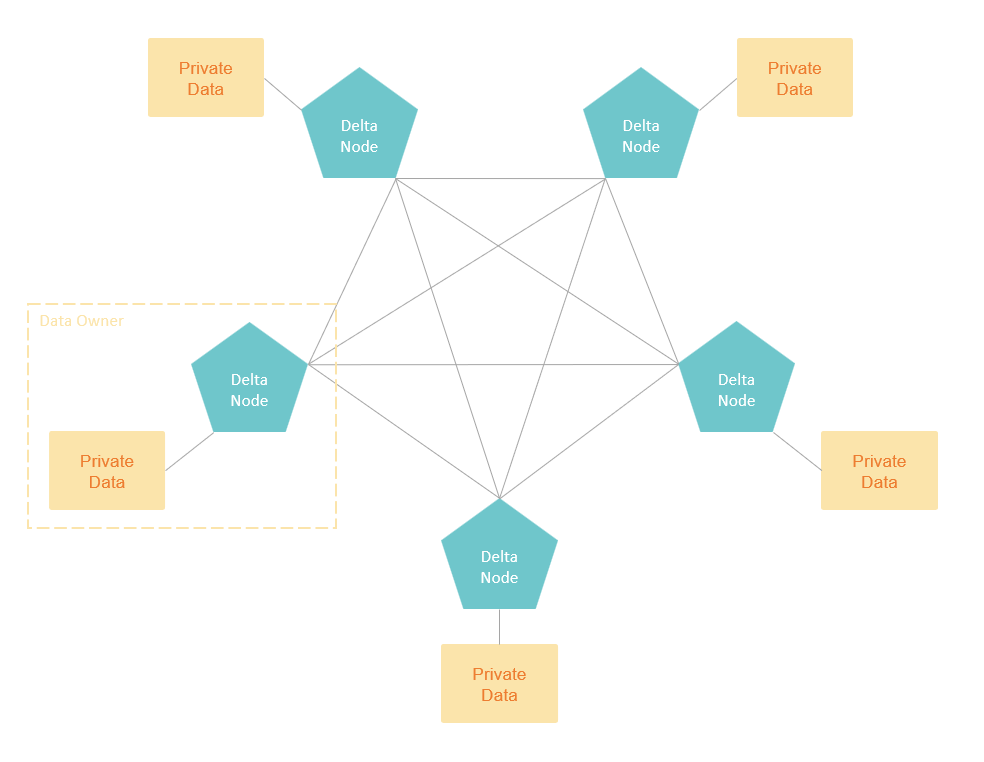
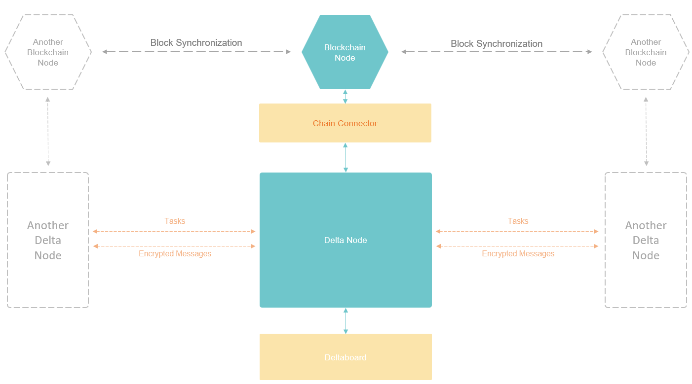
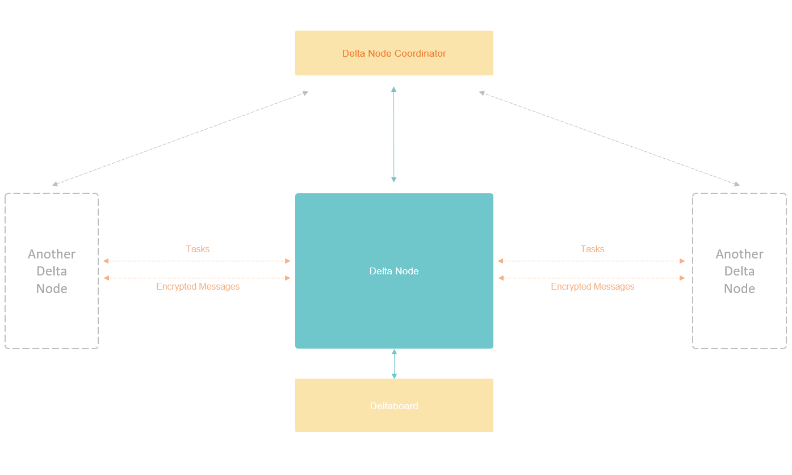
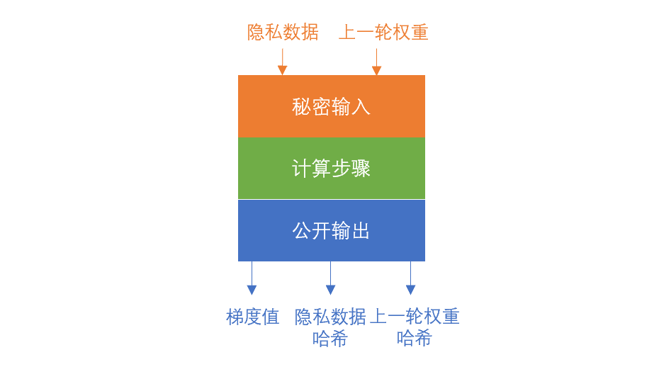

# System Overview

## Network Participants

The participants of the Delta Network could be categorized into 3 classes:

#### Data Owners

Data owners privately own some original data and they don't want the data to be revealed to any other people. Provided that the data will be secure and never exposed to others, data owners receive computation tasks from others, compute them locally and send the result back.

In the context of the Delta Network, data owners deploy Delta Node locally and connect it to their private data. Delta Nodes connect to the network, receive computation tasks, execute them locally on the private dataset, and at the end send the result back, in an securely encrypted format so that no one could decrypt even the original computation result from it. The result could only be used to be mixed with the results from other Delta Nodes to get a clear text statistical value on a wider range of data.

#### Task Developers

Task developers don't possess data themselves. They have some ideas and want to perform computation tasks on other data owners' data. There're usually two types of computation they want to perform: the statistical computation and the machine learning model training. And since they can never have an eye on the original data, they want to be sure that the computation is actually executed as they programmed, and on the real data they required.

In Delta Network, task developers write the computation task codes using the Delta Task framework, send the task to the network through the API that Delta Node provides, and then receive the computation result, together with a zero knowledge proof shows that the computation really happened as required.

To send tasks to the network through a Delta Node, task developers could deploy Delta Nodes themselves, or using one of the Delta Nodes provided by the data owners.

#### Network Deployers

The network deployers are usually able to union several large data owners \(or a lot of small ones\) in a specific industry. Network deployer connects their data by deploying a Delta Network. The data could then be used by other industry participants, or the data owners themself. Since most of the data owners in other industries don't have the ability to deploy Delta Node themself, it is usually network deployer's task to help them with the deployment, the connection and adaptation between the Delta Node and the original data sources. Network deployers are also responsible for the daily maintaining of the system. 

## Network Structure

Delta Privacy-Preserving Computation Network is a P2P network. Each data owner deploys a node to connect to its private data, all the nodes connect to each other to form the network. All the nodes in the network are completely identical, having the same rights and functions. Nodes could join and quit the network freely with no effects on the whole network.

Every node in the Delta Network consists of mainly two parts: the Blockchain node, and the computation node \(the Delta Node\). the Blockchain node and the Delta Node are connected by a Chain Connector, which is an abstract layer to support various of Blockchain systems.

The P2P network is established by all the Blockchain nodes at the beginning. Delta Node connects to the Blockchain node through the Chain Connector, registering its identity on the Blockchain, and then receives tasks from the Blockchain, executes them, and sends the results back.

The will be communications between Delta Nodes as well, thus forming a second layer network. This network is responsible for task details delivery, secret sharing used in MPC, private set intersection, etc.

Deltaboard is the user interface of Delta Node, which gives users the ability to manage the Delta Node using graphic interface. There's also a JupyterLab embedded in to support online editing and debugging of Delta Task codes. Deltaboard supports multi-user access management as well. Each user gets his own Delta Node API so that multiple users could share a single Delta Node instance.

## Delta Chain

The core and the only function of Blockchain is to ensure the execution of some pre-defined rules among multiple parties. Blockchain is useful in building decentralized systems, where no single party should have the decision rights above others. 

In the scenario of the privacy-preserving computation network, every data owner is equal, no one should make decisions that others should follow. But there's these pre-defined rules to distribute tasks, executing them and submit results. This is a perfect fit for a decentralized network built with Blockchain, where every data owner has his own decision of joining and quitting the network at any time. As long as there are requirements for data, and there are someone willing to provide it, the network could just operate normally.

There're two main concerns in the designing of a decentralized system. The incentivization mechanism and the cheating prevention.

In a decentralized system, the system service is provided by a group of nodes. each node could join or quit the system at any time. There're costs running a server node for the system. There must be some profit for the node to make them join the system willingly.

As for the privacy-preserving computation network, the profit of the data owners should come from the task developers. Task developers pay for the usage of the data, and get computation results. Data owners provide the data **and** the computation power, and get payment in return. System could charge a little transaction fee in each task execution, and use it as rewards for early users and system maintainers. This is a basic incentivization mechanism. Blockchain is used to enforce the execution of these rules among system users.

With great incentivization comes great cheating attempts. If data owners could return random computation results to the network without been discovered and punished, they will do so to accept more computation tasks than their **hardware** and **data** is capable of, just to get more profit. One thing to be emphasized is that there're two ways to cheat the system: fake execution, and fake data.

**Fake execution:** return random results to the task.

**Fake data:** perform the real computation task, but on some randomly generated data.

If the cheating can't be discovered, the task developers will be hurt, since they can't get meaningful results. Then they will simply stop using this system. And the system crashes.

The fake execution problem could be solved using Zero Knowledge Proofs\(ZKP\) theoretically, and the fake data problem could be partially solved by a mechanism design including ZKP and third-party audits. We will explain this part in a separated document in detail later.

Delta assumes that incentivization is achieved by the network deployers externally, and focuses only on the technical part of functions and performance of privacy-preserving computation tasks.

The functions of Blockchain in Delta framework is mainly:

**P2P network establishment**: node discovery, communication routes, digital identity, etc.

**Task distribution and coordination**: the rules of distributing tasks, monitoring for tasks, multi-round calculation coordination, result submission, etc.

**Proof of computation and data**: routinely zero-knowledge data check in, ZKP verification and recording of the computation tasks.

Delta Network provides [Delta Chain](https://github.com/delta-mpc/delta-chain) to start the required Blockchain node. Beside that, Delta also supports other Blockchain systems as long as that Blockchain has smart contract runtime, and the [Delta Smart Contracts](https://github.com/delta-mpc/delta-contracts) are successfully deployed on it. The only requirements on the Blockchain is that it supports [EC-Pairing](https://medium.com/@VitalikButerin/exploring-elliptic-curve-pairings-c73c1864e627) which is required by the ZKP algorithm.

Delta provides [smart contracts written in Solidity](https://github.com/delta-mpc/delta-contracts), which could be used on Ethereum directly. To support multiple chain systems, Delta has an abstract layer called [Chain Connector](https://github.com/delta-mpc/delta-chain-connector), in which switching to different chain system is quite simple. Chain Connector also supports cold wallet, to safely keep the private key in an isolated network environment where does not accept incoming connections. Deployers could use a separated signing service installed inside the isolated network,  fetches transactions from Chain Connector, signs them and sends only the signed transactions back.

## Delta Network without Blockchain

The block intervals of the Blockchain system will cause a dramatic slow down on the execution of computation tasks. In the scenarios where computation verification is not required, Delta Network could be started without Blockchain node.

To start Delta Network in this mode. Just set a Chain Connector to coordinator mode. And connect all the Delta Nodes to it. Chain Connector in coordinator mode doesn't need Blockchain. Acting as a center node of the network, Chain Connector could handle the network establishment and task coordination itself.

## Delta Node

[Delta Node](https://github.com/delta-mpc/delta-node) is the core of the Delta framework. It is in charge of the whole life cycle of a computation task including task registration, task coordination across multiple nodes, local task execution, result submission, result aggregation, etc. Delta Node is also responsible for keeping local private data safe while providing APIs for IDEs and other systems.

The Data Connector of Delta Node connects Delta Node to the private local data sources. By using different adapters, various types of data sources could be supported, such as files, relational database like MySQL, and HDFS.

Delta Node could be divided into 2 parts: the server and the client.

The server is where Delta Task starts. After task developer finishes the coding of task logic. The task is sent to the network through the server's API. The server registers the task on Blockchain to start the execution of the task. The client of other Delta Nodes will get the task code from the server. After the task is executed on the clients of other Delta Nodes, Other clients will send the encrypted fragments of their computation results to the server. It's the server's duty to aggregate all the fragments to get the final clear text computation result. In a multi-round model training task, the server will register rounds separately on-chain and sums up all the results from multiple rounds to get a final result. The final clear text computation results could only be collected and decrypted by the server to keep the final result private.

The client is the actual place where Delta Task executes. The client monitors the Blockchain for tasks regularly, and execute it in the local Secure Execution Environment. Note that this is not Trusted Execution Environment, a.k.a. TEE, which is another kind of confidential computing technology using CPU-level encryption. SEE ensures the Delta Task, whatever execution logic it contains, when executing, has no impact on the host server, and can do nothing else other than performing computation logic on the given data. There're 3 aspects to take into consideration:

**Privacy-Preserving Algorithms.** The first layer of protection, is of course the privacy-preserving algorithms. SEE ensures that all the network outbound traffic of the Delta Task should either go through the Secure Aggregation layer, or go through the Secret Sharing mechanism of the MPC algorithm. So that no clear text original data and original computation result could be sent to the network.

**Security Check on Delta Task.** This part of SEE scans the Delta Task for malicious codes. The computation logic could be transformed into a flow of connected computation gates. If there're code logics that are irrelevant to the flow, the codes are malicious. The client could refuse to execute such tasks to keep the host safe.

**Execution Environment Isolation.** Including runtime isolation and network isolation. In case that some vulnerabilities on the host machine are exploit to execute codes that are not allowed. The codes might further get access to the original data, and leak it to the network.

The client will have network communications with other Delta Nodes to fetch the Delta Task content, send results back to the task initiator, and exchange secret sharing messages when performing MPC.

When performing computation tasks, the client needs access to the original data, which is provided by the Data Connector. A standard defining how data is structured is critical to the network. Since the task developer is designing the computation task without knowing what the data is actually like, while they have to know it to write the code. On the data owners side, every data owner has its own way of storing data in its own structure, but the computation task must be performed exactly the same way on every data owner's machine.

This's where the data standard plays an important role. The data standard describes what kinds of data the network, as a whole, possesses. If the data is a table, what columns does the data have, what is the data type of each column, are all included in the data standard. The developers use the data standard in their code to claim what dataset the task needs, and the code performs the computation based on the data type in the data standard. Each data owner connects its original data to the Delta Node using an adapter to convert the data to the format defined in the standard so that the Delta Tasks could run smoothly.

